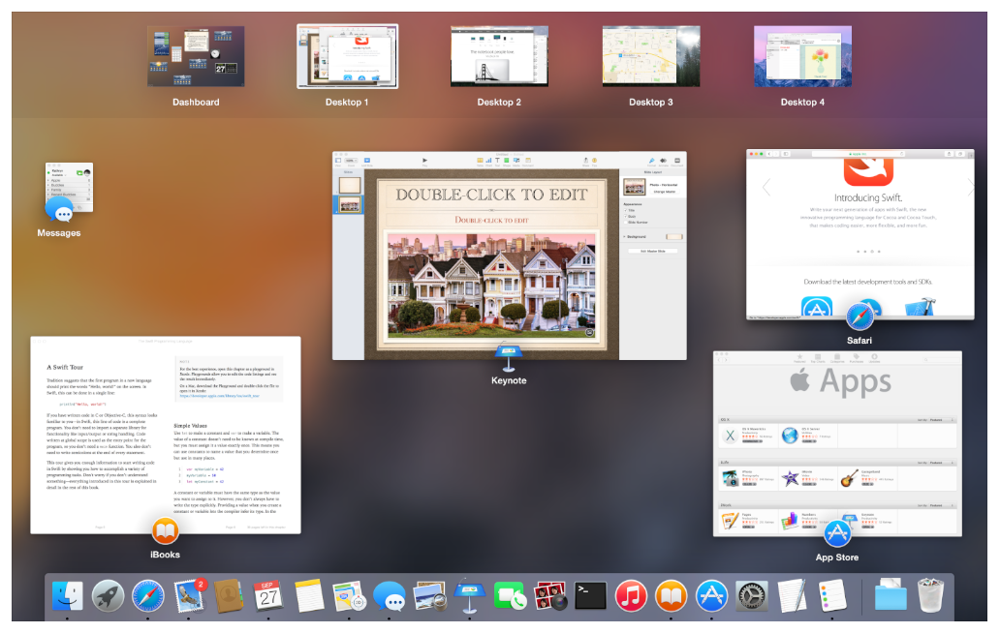
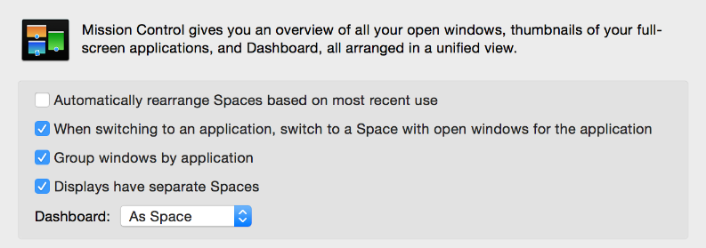
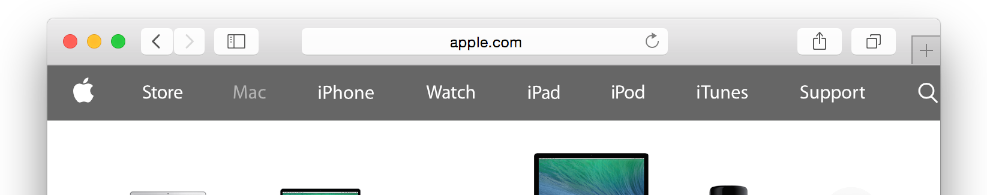
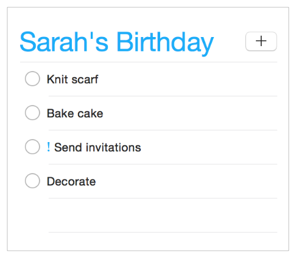
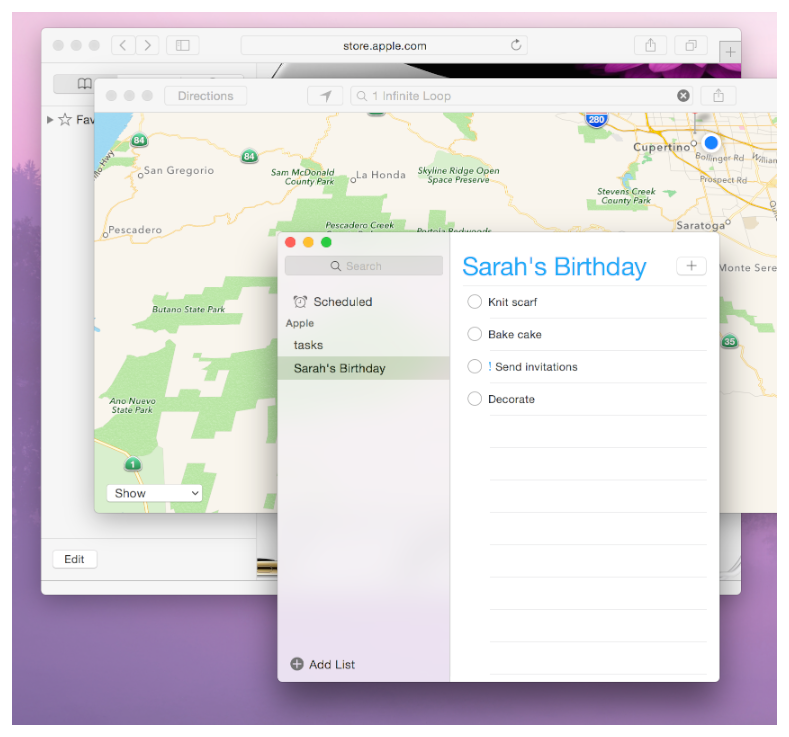
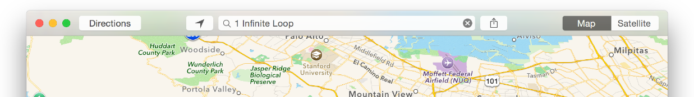

# 为 Yosemite 设计

人们喜欢 Mac 操作系统 (OS X)，因为它提供了所有用于创作，管理和体验的所需的工具与环境。一个优秀的 Mac 应用可以在无缝接入系统，同时提供个性化的功能和体验。

在进入文档内容之前，我们不妨先来看看 OS X 是怎么从简化、统一和层次(Simplicity, Consistence and Depth)三个方面，营造一种关注于内容的用户体验的。

首先，OS X 为了突出核心功能，弱化了很多界面造成的影响。比如 Yosemite 就对很多系统应用的图标都做了减法，在保留优雅与易于辨认的基础上去掉一些不必要的装饰。

Yosemite (10.10) 的日历图标

Mavericks (10.9) 的日历图标

至于系统字体，则采用了苹果优化过的 Helvetica Neue。这种字体使得整个系统展示的文字更加优美，也更加清晰。

还有窗口标题栏，新的系统把标题栏与工具栏整合到一起，即保留了原有的功能，也让界面更加清新。

总而言之，Yosemite 的界面使人眼前一亮，而且沿袭了苹果一贯的风格，使用户感觉宾至如归，不会太过跳跃。而这，就要归功于苹果统一的设计风格了。

比如系统图标的设计风格，是在和谐与稳定之间找到一种平衡。主要有两类风格：

写实风格：Preview, Mail, Photo Booth 和 Dictionary 这些系统应用的图标都使用了这种风格。这些图标在细节，透视，光源以及渲染风格上达成统一。

图形化风格：iTunes, iBooks, App Store 和 Safari 则采用了圆形抽象图标的风格。这些图标里的符号都采用了同样的压花效果，并且统一了所有图标的轮廓形状和颜色搭配。

使用优化过的 Helvetica Neue 作为系统字体意味着统一了操作系统和应用文本的显示效果。而且使用这种字体还可以跟 iOS 的体验保持一致。用户可以在 iOS 和 OS X 之间流畅地进行切换。

OS X 的提醒事项

iOS 的提醒事项

Yosemite 在物理维度上提炼、细化、完善了视觉效果。具体来说，Yosemite 采用了半透明 (Translucency) 与模糊 (Vibrancy, 直译为振动并不达意，以下直接以英文代称) 效果，使界面更加扁平化，使用户更专注于的内容。(Vibrancy 是一种优雅的渲染效果，这种效果会自动吸取当前视图底下一层内容的颜色作为当前背景。)

如下图，阴影，半透明和 Vibrancy 效果让激活窗口跃然纸上，一下就抓住了视觉的焦点。

半透明的工具栏弱化了窗口的存在感，更突出内容。

侧边栏和遮罩分别使用了两种不同的 Vibrancy 效果来突出内容。

如果是用于应用内导航的侧边栏，比如 Finder，则让 Vibrancy 透过窗口显示后面的内容。

如果是用于提供选项和控制当前窗口内容的遮罩，比如说地图应用的导航视图，则让 Vibrancy 透出遮罩层下面同一个窗口里的内容，这样可以给用户一种更为广阔的视野，不会因为内容被遮罩层挡住感到界面太狭窄。

系统的通知中心使用了深色 Vibrancy 效果，透出底下的内容，让用户在打开通知中心的时候能留在当前的使用情境，不会太跳跃。

译者注：那么总的来说我们可以说 Vibrancy 的好处有四点：

1. 吸引视觉焦点
2. 暗示功能地位（透视的内容不同意味该界面的功能级别不同）
3. 拓宽视觉广度（界面不觉逼仄）
4. 延续当前情境