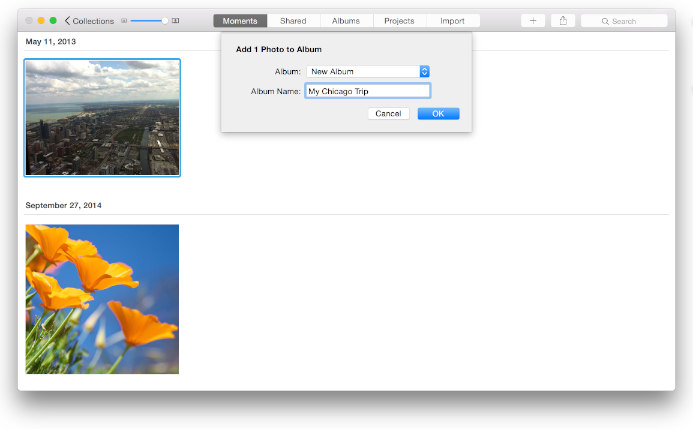

## 应用风格剖析

总的来说， OS X 的应用有三种风格。（译者注：这个总结比较空泛，相比起 iOS 严格的设计规范，OS X 要自由得多，这也导致 OS X 应用的设计各式各样，不尽相同。）

1. 单窗口工具型

比如系统的计算器和字典应用，所有的任务都在单一窗口里面完成。其中关于、设置之类虽然是另一个窗口，但他们都是辅助信息，用户最主要是关注的还是主窗口。

2. 单窗口“鞋盒”型

这种类型应用一般会提供在应用内查看和管理内容的功能。比如说 iPhoto(译者注：原文没有明指，但是看起来 iPhoto 应该符合这种类型)，用户并不希望在 Finder 里面逐个找到自己拍的照片然后再打开另一个应用来处理这些照片，于是，iPhoto 这样的应用就提供了可以在同一个应用里查看，管理和编辑照片这样的功能。

3. 基于文档的多窗口型

比如说 Pages，每一个文档对应一个新窗口，用户可以在不同的窗口里面查看、编辑不同的文档。这种应用一般会有一个主窗口作为应用的入口。(这个主窗口不一定是主要使用场景，也可以是一个设置面板，或者辅助窗口，比如 iA Writer 启动的时候就只展示一个文件选择器。)

但是不管哪一种风格都好，所有的 OS X 应用的入口都只是窗口或系统菜单栏。窗口可以是一个或多个，菜单栏也可以根据不同的应用提供不同的功能。

苹果提供的 AppKit 框架定义了窗口、菜单、控件和其他界面元素。同时 AppKit 也提供了一些应用级别的特性，比如说手势识别，字体管理，图像处理，辅助功能以及语音识别等等。此外， Yosemite 还定义了深、浅两种 Vibrant 视觉效果，你可以在代码里面用 NSVisualEffectView 来实现。

抛开技术细节，从广义上看，AppKit 提供的界面元素可以分为以下几类：

- **窗口(Windows)** 窗口构成应用内容展示的框架。
- **菜单(Menus)** 菜单包含了用于控制这个应用的各种命令，比如说编辑菜单项，里面就包含了复制、粘贴等各种编辑命令。
- **内容视图(Content Views)** 内容视图是用来展示内容的，比如说文本视图，悬浮层视图等等，一个视图也可以包含用于管理视图内容的控件。
- **控件(Controls)** 用户会靠按钮，滑动条，多选框等控件来完成输入动作，或者执行一项任务。

为了控制种类繁多的 UI 控件，你需要使用各种不同的控制器(Controllers，下文以英文直称)，比如说窗口控制器，列表控制器和多栏视图控制器。其中最典型就是窗口控制器，一个窗口控制器（Window Controller）往往包含多个视图控制器，而每个视图控制器又可以控制一组视图或一组控件。

故事板（Storyboard，Xcode 提供的以视觉方式编写界面代码的工具，以下以英文直称）就是用视觉效果来展现应用架构的好例子。一个场景(Scene，以下英文直称)表示一个 Controller 及其所管理的多个 View，而一个继续符（Segue，以下英文直称）则表示两个场景之间的关系。这两个场景可以是包含关系（比如一个 Window Controller 包含了一个 View Controller），也可以是展示关系（Presentation，一个 View Controller 可以展示一个悬浮层 Popover 在上面）。

	提示
	如果你也在 iOS 上面用过 Storyboard，那你应该知道 OS X 跟 iOS 不太一样，OS X 的应用一般都很少有展示关系，而更多的是包含关系。这种差异说明 OS X 比起 iOS 有更大的屏幕空间可以展示内容，也就是说一个 View 其实没什么必要在它上面覆盖另一个 View，多数时候可以直接展示在同一个平面里。

