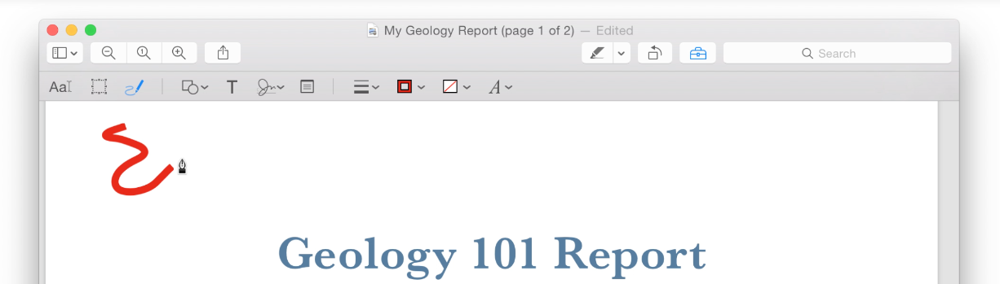

# 模态

模态是用来展示或者体验某种事物的一种模式。(原文：Modality is a mode in which something exists or is experienced. )模态可以给用户提供一个专注完成某件任务或者获取某些信息的途径，但是模态也会让用户暂时无法和应用其他部分的界面进行交互。（译者注：原文解释得有点拗口，简单地说，一个警告框就是一种模态，在关闭警告框前其他的界面是无法响应用户的操作的。）

所以，作为一个设计师，你要做的就是权衡模态的利弊，让用户既能专注内容，又不会太受束缚。

举个例子，当用户在系统的预览应用 (Preview) 里面使用涂鸦 (Sketch) 功能的时候，用户是不能选中或编辑文本的。

**只在必要的时候使用模式。** 举几个例子：

- 需要用户关注重要警告的时候
- 必须完成一些任务才能进行下一步的时候。
- 一定程度上，当前在做的操作本身就是模态的。比如说正在使用画图软件的笔刷，或者在文档编辑器里面修改字体等等。

**请慎重考虑需要用户频繁进出模态的设计。** 一般情况下，不要频繁打断用户当前的操作，也不要用滥用分散无关的模态操作，这些都会带来不完整的体验。要尽可能把模式用在能够被用户一口气完成的小任务上面。

**少用模态和用户需要专注之间，要做好权衡。** 有些时候用户更希望有一个独立专注的环境来完成某些特定的任务。为了满足这种需求，你就得设计一种既能实现隔离又能无损体验所有功能的模式。但是你不能简单地让用户进入一个模式获得某种信息，然后再切换到另一个模式去做另一件事，这种复杂的切换操作用户是不会买账的。最好的情况是让用户无论在什么时候都能够体验到所有的功能，所以除非模态用在这里很有价值，否则轻易不要用模态。

**模态影响的范围越小越好。** 举个例子，如果是一个文档窗口需要用到模态，那么就应该针对那个文档的使用模态框，这种模态框也叫 Sheet（译者注：比如 Pages 的打开文件的选择窗口）。Sheet 可以阻止用户与当前窗口其他部分的交互，但是不会影响这个应用的其他窗口。详情请见[对话框]()一章。

**明确指示出用户当前所处的模式。** 要让用户一眼就能看出是处于什么模式。比如说，画图软件可以用不同的指针样式来代表不同的模式，比如笔刷指针代表绘画，橡皮擦指针代表擦除等等。使用分隔控件（Segmented Control）也可以告诉用户当前是处于什么模式。比如说 Finder 的工具栏里面的 Segnmented Control 就可以指示当前视图是处于图标模式，列表模式还是多行模式。使用浮动层（Popover）来展示一项独立任务则可以给人较强的视觉提示。更多关于浮动层的内容，可以参见[浮动层]()一章。

**要能很容易地退出一种模式。** 必须要提供很容易就能离开当前模式的方法，比如说，你可以显示一个浮动层，当用户点击浮动层以外的区域时就自动关闭（比如 iMessage 的表情面板）。同时为了防止误操作退出了当前模式而丢失数据，必要的时候你还得提供保存当前设置的功能。

**不要滥用警告框。** 只在必要的时候才弹警告框，尤其不要用警告框来展示无法交互的内容（译者注：比如完全没有退出按钮的警告框）。一个警告框应该要把问题描述清楚，解释为什么会出现这种问题，并且提供下一步操作的选项（译者注：比如没网络的警告框就有“选择网络”的按钮）。真的出错的时候，你还得防止用户数据丢失，要在警告框里告诉用户可行的备选方案。关于如何创建一个好的警告框，请参见[警告框]()一章。