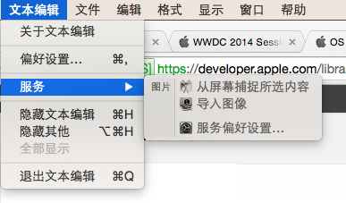

# 协作性

具有协作性的应用可以无缝地接入其他应用，直接使用其他应用的功能。这就意味着用户可以不再理会应用层面的细节，只要关注内容就可以了。

**接入系统扩展和服务。** 当用户在你的应用里执行一项比较重的任务的时候，他们更希望通过扩展（App Extensions）来实现一些特定的任务。比如说，用户在文本编辑器（TextEdit）里面如果想插入一张图片，可以选择菜单里的服务选项，调起其他的应用来选择图片。

当用户想编辑这张图片的时候，可以直接在 TextEdit 中用系统集成的 MokUp 应用来编辑。

**接入 HandOff。** Handoff 可以让用户把在某部设备上正在做的事情，无缝转移地到另一台设备继续工作。由于 Handoff 是基于“用户当前正在进行的任务”这个概念来设计的，所以首先你得定义好哪些任务是需要做无缝切换的，关于 Handoff 更多内容，请参考 [Handoff 编程指南]。

**尽量不要用自定义的文件格式。** 相反地，要多用标准文件格式，这样用户可以使用多个应用打开同一个文件，各个应用之间也可以很方便地交换数据。如果你一定要用自定义格式，那请确保你提供了导入导出功能，可以把你定义的格式转换为通用的格式，这样用户才能方便地把你的文件分享出去。必要的时候，你还得做好系统 Quick Look 数据的转换，确保你的文件能够被 Finder 和 Spotlight 预览。更多关于 Finder 和 Spotlight 的信息，请参见 [The Finder]() 和 [Spotlight]()。

**避免让用户关注你的文件格式。** 最佳的做法是用户完全不需要关心你的文件是什么格式的（要知道，Finder 的设置项里面是可以隐藏掉文件扩展名的）。一般来说，用户期望你的应用可以打开其他应用创建的文档，而你的应用创建的文档又可以被分享出去在别的应用里正常打开。所以，你在保存文件的时候要能够根据不同的文档内容选择对应的文件扩展名。但是与此同时，在你的应用里面显示文件扩展名的时候，要尊重用户的设置，如果用户设置了隐藏扩展名，如过不是必须强调的地方，就不要显示出来了。

**在所有平台使用同一个文件格式。** 使用同一种文件格式可以让用户在所有平台都能用你的应用来打开你的文件，而不需要去关心他们用的是什么设备，什么平台。

**不要省略文件扩展名。** 所有平台都可以通过文件扩展名来判断这个文件的类型。尽管 OS X 的用户可以隐藏文件扩展名，但是你在保存文件的时候还是要有文件扩展名的，这样其他平台才可以通过扩展名来判断用哪种方式去打开你的文件。

**使用用户默认系统（User Default System）来保存用户设置项。** 使用系统提供的 User Defaults System 生成的设置项会被写进一个 plist 文件里面。你可以用 [NSUserDefaults]() 对象来获取和修改这些设置信息。详情请参见 [NSUserDefaults Class Refrerence]()。

**使用标准协议做数据交换。** XML 格式应用广泛，也是跨平台的数据格式，这里首推 XML 格式。

**在 IP 网络中，你可以使用 Bonjour 自动发现同网中的设备和服务。** 千万别让用户输入 IP 地址，或者设置 DNS  地址。（译者注：面向普通用户的应用如果还要手动输入 IP 和 DNS，估计没几个人用的了。）