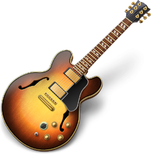
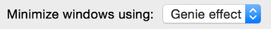

# 措辞和用语

文字说明被广泛应用在整个 OS X 系统中，比如按钮的名字，菜单项的说明，对话框里的提示语，帮助标签里的说明等等。如何把文字说明做到清晰易读、风格统一是界面设计中非常重要的一环。

就像应用的图标应该交给专业的绘图设计师来制作一样，应用里的文字说明就应该让专门的写手来做。一个职业写手可以依据你的应用的设计开发一套语言风格，让这种风格贯穿整个应用。

关于苹果特有的术语，写手们可以参考[苹果风格指南 Apple Style Guide](https://help.apple.com/asg/mac/2013/)文档。这篇文档涵盖了苹果的风格规范，专有名词使用规则，以及苹果对语言使用的研究。

对于那些苹果风格指南里面没有覆盖的内容，苹果推荐大家看三本书：《The American Heritage Dictionary》，《The Chicago Manual of Style》，《Words into Type》。如果这几本书的内容有相互矛盾之处，那么关于用法部分请以《The Chicago Manual of Style》为准，拼写部分则以《The American Heritage Dictionary》为准。

## 使用面向用户的措辞

大多数应用都需要通过文字说明来跟用户交流，即使只有按钮上的几个词汇，也属于文字说明的一种。所以怎么对无处不在的说明文字遣词造句就非常重要，要让用户准确理解文字的意思，不要模棱两可，造成误会。

**要尽量避免使用专业术语。**  最重要的是要让用户阅读的时候感到很舒服，不要产生疑惑。如果应用的受众是早已熟知各种技术用语的老手，用点专业术语关系不大，但是如果受众是普通用户，那你最好还是用一些简单的，多数人都能理解的说法。举个例子，系统的家长控制面板就用了很简单直白的语言来描述这个功能。

**避免使用开发者的术语。** 作为一个开发者，你所熟知的一些界面控件的名字可能并不是广大用户能够理解的。所以最好不要在界面上出现这些开发用语。下表列出了一些开发用语和用户熟知的语言的对比，可供参考。

Table 12-1 一些开发用语和对应的用户用语

开发用语 | 用户用语 
----|-----
Cursor | Pointer
Data browser | Scrolling list or multicolumn list
Dirty document | Document with unsaved changes; unsaved document
Error message | Alert message; message
Focus ring | Highlighted area; area ready to accept user input
Control | Button, checkbox, slider, menu, and so forth.
Launch | Start
Mouse-up event | Click
Override | Take the place of; take precedence over
Reboot | Restart
Sheet | Dialog
String | Text
String length | Number of characters

译者注：中英文习惯不同，挑其中几个比较有代表性的列举如下：

开发用语 | 用户用语 
----|-----
控件 | 按钮，滑动条，菜单之类的
鼠标事件 | 点击
字符长度 | 字母个数
模态框 | 警告框

**选择合适的苹果定义的术语。**  如果你需要描述一个标准控件，可以优先选择苹果定义好的一套术语。比如说一个多选框的使用，不要让用户“打开”或者“点击”多选框，而要用“选中”多选框。再比如让用户点击 Dock 上的图标来启动你的应用，这里的 Dock 请一定要首字母大写。[苹果风格指南]()里面会介绍到很多这样的术语。

## 使用简洁的说明文字

说明文字要简洁易懂，但是不要因为空间太小放不下就用含糊不清的说辞。

**对于当前场景下很明显的事情，就不要赘述了。** 比如在一个文档的保存对话框里面，很明显这个对话框是针对当前文档的操作，就没有必要再在说明里面强调是针对“当前文件”或者“当前文档”了。同样的，用户也能理解编辑菜单针对的是当前文档，所以菜单项的命名里面就不要再出现“当前文档”的字样了。

**使用正确的首字母大写形式。** 首字母大写的风格有多种，比如全部单词首字母大写或者除介词外首字母大写。如何正确地使用首字母大写的形式，[正确的首字母大写形式]()一节有详细的说明。（译者注：首字母大写在中文里用不上，但是对于想做国际化的应用来说还是很有帮助的。）

**对于能够打开一个新的对话框的菜单项或者按钮，要在名称后面加上省略号（…）。** 省略号表示用户还需要进行下一步的操作。弹出的对话框的标题应该跟菜单项或按钮同名。更多关于省略号的使用说明，请参考[用好省略号 Using the Ellipse]()一节。

## 正确的首字母大写形式

所有的界面都会用到两种首字母大写形式：标题式和语句式。

**标题式首字母大写。** 除了以下几种单词，其他单词全部要求首字母大写：

- 冠词（a, an, the）
- 并列连词（and, or）
- 四个或少于四个字母的介词。其中介词是名词词组的一部分除外，比如“Starting Up the Computer”，这里 Up 和 Start 组成词组 Start Up。

但是，不论在什么情况下，第一个和最后一个单词的首字母都要大写，不管是不是冠词、连词、介词。

**语句式首字母大写。** 即第一个单词的首字母大写，其他的单词除非是特有名词或者形容词，否则都用小写。

界面元素 | 首字母大写风格 | 例子
---- | ---- | ----
Menu titles | Title |  Highlight Color   Number of Recent Items   Location Refresh Rate
Menu items | Title | Save a Version   Add Sender to Contacts   Log OutMake Alias   Go To…   Go to Page…   Outgoing Mail
Push buttons | Title | Add to Favorites   Don’t Save   Set Up Printers   Restore Defaults   Set Key Repeat
Toolbar item labels | Title | Reading List   Zoom to Fit   New Folder   Reply All   Get Mail
Labels that are not full sentences (for example, group box or list headings) | Title | Mouse Speed   Total Connection Time   Account Type
Options that are not strictly labels (for example, radio button or checkbox text), even if they are not full sentences | Sentence | Enable polling for remote mail   Cache DNS information every ___ minutes   Show displays in menu bar
Maximum number of downloadsialog messages | Sentence | Checking for new software…   Are you sure you want to quit?

## 谨慎使用缩略词

像菜单这种控件，文字展示的空间比较局促，所以只要缩略后的词句没有明显的歧义，就可以用缩略来换取空间。比如说下面这几句缩写：

Don’t Allow Printing （译者注：全称应该是 This document don’t allow printing.）
Don’t Allow Modifying
Don’t Allow Copying

在这个例子中，缩略并没有造成歧义。如果缩略会影响本来的意思，就不要用缩略，比如“contains”和“Does not contain”就是完全不同的意思。

尽量避免使用鲜为人知的缩略，特别要注意以下两点：

- 避免把一个名词和动词混在一起缩略，比如“Apple’s going to announce a new computer today”.
- 避免使用不常见的缩略，比如 “it’ll” 和 “Should’ve”。

译者注：这一小节指的缩略应该是单纯地去掉其中几个单词这样的意思，而下面要讲到的缩写才是把几个单词合并成一个单词这样的意思。

## 只用用户能理解的缩写

缩写（包括提取每个单词首字母的缩写）可以节省界面空间，但是如果用户不理解缩写的意思反而会弄巧成拙。另一方面，有一些缩写比起全称更广为人知，这时如果还非要把全称写上去就会显得过时而且累赘。

为了平衡上述两种极端，我们得谨慎选择更适合目标用户的缩写。考虑是否使用缩写可以从以下几个问题入手：

- 缩写比全称是否更容易理解，更符合习惯？比如，所有人都知道 CD 是光盘（compact disc）的缩写，所以即使目标用户是普通用户也可以使用这个缩写。

另一方面，针对有专业色彩知识的用户设计的应用，可以直接用 CMYK （cyan magenta yellow key，一种印刷色彩模式）这样的缩写，即使有相当一部分人都不懂这是什么意思也没有关系。

- 比起缩写，全拼的单词会不会更鲜为人知？比如大家都知道 Cc 是复印件（carbon copy）的意思，但是今天人们使用的 Cc 已经不是用来表达复印文件这层意思了（Cc 表示邮件里的抄送），如果你还用 carbon copy 来代替 Cc 反而让用户感到困惑。

有些缩写，其准确的全称反而会引起歧义。比如 DVD，全称可以是数字影碟（digital video disc）或者通用数字光盘（digital versatile disc）。由于这种二义性，直接用 DVD 要好过单独使用其中一种全称。

如果你在帮助文档里面用到了一些用户可能不太熟悉的缩写，最好是先声明这些缩写代表的是什么意思。关于帮助文档的相关内容，请参见[用户帮助]()一章。

## 用省略号表示还有下一步输入动作

按钮或菜单上的省略号（...）可以告诉用户：还需要提供一些其他的信息才能完成这个按钮的任务。省略号还可以暗示用户点击这个按钮之后很可能会弹出一个新窗口或对话框，用户需要在新窗口里输入一些信息。

用户本来期望这个按钮点下去立刻就能实现按钮描述的功能，省略号可以让用户提前预估到下一步跟预期的可能不太一样。以下例子可以告诉你什么时候应该在菜单和按钮上加省略号。

**以下情况应该使用省略号：**

- 按钮触发的动作需要让用户输入特定的信息。

	比如打开文件和打印文件，两者都需要用户选择文件，又比如查找，需要用户输入查找内容，所以这些几个命令都加上了省略号。

	你可以认为这一类的命令在执行之前都需要用户先提供一个答案（比如“查找什么？”）。

- 按钮触发的动作会打开一个独立的窗口或者对话框。

	比如苹果菜单里的系统设置项和 App Store 项、Finder 的自定义工具栏菜单，都加上了省略号。系统设置项要打开一个新窗口，App Store 直接打开一个应用，自定义菜单则是打开一个新的对话框。

	要理解这些省略号的意义，我们可以反过来想象一下如果没有省略号对用户来说会有什么影响。比如自定义菜单栏，如果没有省略号，就给人一种“点了这个按钮就会使用一种固定的自定义形式”的感觉，而不是说我点了这个按钮可以自由选择多种形式的组合。

- 按钮触发的动作会先展示一个警告窗，告诉用户潜在的危险，并提供相应的备选方案

	比如重启，关机，退出这些操作都用了省略号，这些操作都会弹一个对话框，都提供了取消按钮。这里要注意，窗口的关闭按钮没有省略号是因为关闭窗口这个动作一般不会弹警告框，只有特殊的情况才会弹警告（比如关闭一个还没保存的文件的时候）。

	在你决定要让一个按钮每次都会弹窗之前，你得考虑清楚是不是真的有必要每次都警告，因为如果你弹窗太过频繁反而会让减弱用户的危机意识，用户可能习惯性就按确定按钮了。

**以下情况不宜使用省略号：**

- 按钮触发的动作不需要用户提供输入信息的时候。

	比如新建文件，保存文件以及复制文件都不需要用户提供信息，所以不需要省略号。

- 按钮触发的动作就是要打开一个新面板。

	如果用户打开一个面板是用来查看更多信息的，比如查看文件信息，这种时候就不要加省略号了。关于面板设计的更多内容，可以参考[面板]一章。

- 按钮触发的动作只有部分情况下会弹出警告框。

	省略号会让用户觉得点了这个按钮警告框是每次都会弹的，这时候如果不是每次都弹，就让应用表现不一致，让用户觉得很困惑。比如关闭按钮，只有在文档还没保存的时候才会弹警告框，其他时候是不弹的，这时候就不要用省略号。

当一个文档的标题或者列表的某一项显示不下的时候，我们可以用省略号来代替显示不下的内容。对于标题来说，最好是把省略号放在中间，因为这样就保留了开头和结果的文字，用户更好辨认这是哪个文档。

	重要提示
	注意要用 Option + ; （Option+分号键）来输入省略号，这样打出来的省略号才能被辅助应用正确解析，给用户正确的提示。如果你是用重复的点符号来模拟省略号，很多辅助应用就认不出来了。而且，重复的点符号和省略号在视觉上也有差异，两种符号每个点之间的间距是不一样的。

## 使用冒号来连接说明文字和控件

在控件和说明文字之间可以使用冒号 (:) 作为连接，文字的主旨是说明这个控件的作用。说明文字和控件通过冒号连在一起，视觉上给人同属一组的感觉，可以帮助用户更直观地了解这个控件的用途。

冒号是用来连接说明文字与一个或多个控件的，所以冒号**不应该**出现在以下场景中：

- 控件本身的说明文本，比如按钮的名字或者一个下拉菜单的标题
- 菜单项（除非冒号是用户自己加的）和菜单标题。
- Tab 和分段控件（segmented controls）
- 列表的表头。（Table view column headings）

	注意
	在 OS X 系统里，文件的路径名是不用冒号做分隔的。如果确实要在应用里显示路径名的话（一般不建议这么做），请用斜杠符（/）做分隔。永远不要把路径名直接显示在窗口的标题栏里面。

冒号是用来连接说明文字和控件的好办法，但不是唯一的办法。除了冒号以外，你也可以用 Tab 视图来展示多组不同的控件。关于使用 Tab 视图的指南，请参考[Tab View]()一章。

**控件组的标题里不要出现冒号。** （控件组是用来从视觉上划分出一个区域的控件，如下图所示）控件组本身就已经有了连接说明文字和区域内的控件这样的作用。更多关于控件组的信息，可以参见[Group Box]()一章。

**带冒号的说明文字应该放在对应的控件之前。** 这些说明可以是一个名词或词组，用来描述这个控件的用途。以下几个例子展示的是说明文字与控件的空间位置关系：

- 文字与控件在同一行
	
		

- 文字与一列控件的第一行对齐
	
		

- 文字在一组水平排列的控件的最左边

	

- 文字在控件上方
	
	

- 在一个多选框或者单选框里面使用冒号引出后面的控件（注意：如果前面的控件跟后面那个无关就不要用冒号，比如下图，后面那个控件是否生效时由前面那个来决定的，这时候可以用省略号。）

	

	注意
	如果你采用了上图的这种形式，当第一个控件没有选中的时候，第二个控件记得要置于禁用状态。

**如果一个控件是一句话或者一个词组的一部分，那么是否加上冒号就见仁见智了。** 这点比较灵活，因为要根据具体的情况来做决定，比如控件后面的文字有多长，具体这句话是断句的等等，要综合考虑文本和控件的组合形式还有窗口的整体布局等因素，才能决定是否使用冒号。

如果一个句子到了控件这里就结束了，即控件是句子的结尾，那么这时候用冒号是比较好的做法，因为这种情况其实是说明文字+控件的变种。比如下面这个例子， 控件上的 "Genie effect" 就是整个句子的结尾：

	

如果控件后面还有句子的一部分，那么冒号就可有可无了。

	

以此类推，只要控件后面有文字，并且是一个完整句子或者词组的一部分，就可以不加冒号。在这种情况下，可以先假设如果句子被冒号切成几段（甚至）的时候意思会不会显得不自然，如果会，就不要加冒号。

## 去掉句子间多余的空格

如果你的界面需要显示多个句子，请确保句号与第一个字母之间只有一个空格。多数控件都只需要简短的说明文字，但是像帮助文档，警告窗和对话框这些控件就常常会包含很长的文本。你需要仔细检查这些长文本，确保没有多余的空格。