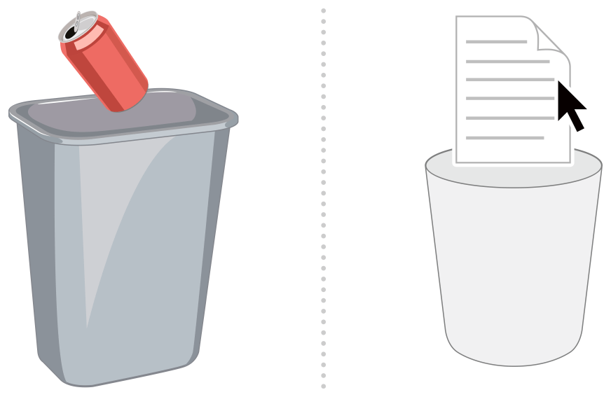
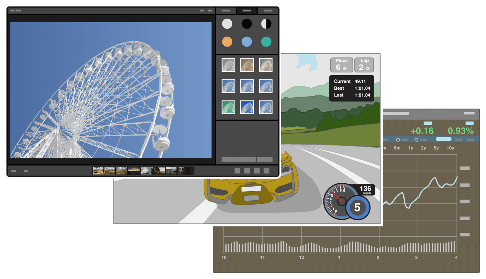

# 设计策略 一

## 设计原则

所有优秀软件的设计都遵循着一系列经过时间考验的设计原则，下面我们要探讨的设计原则，将指导你如何创作一个优雅高效，直观易用，令人愉悦的应用。

### 符合用户的心智模型

心智模型指的是人们脑中对于某件事物或者某种概念的认知。（译者注：有点像柏拉图的理型论。）这些心智模型会随着人们对虚拟和现实世界的学习而自我完善，同时不断建立新的模型。

用户在使用应用的时候会带着一定的心智模型，这些模型直接影响用户的心理预期，所以，认识并尊重这些模型就成了设计里面非常重要的一环。比如开发一个电子邮件应用，首先要了解电子邮件相关操作（比如编写，阅读，发送和管理电子邮件）和相关概念（比如邮件，收件箱和邮箱地址等）。如果往更深一层去发掘，你会发现人们是基于现实世界的心智模型来使用电子邮件的。比如现实世界里的写信，送信，收信等事件就是电子邮件里用户的心智模型。一个优秀的应用可以利用好既成的心智模型，让应用操作更加直观，用户体验更加舒适。

虽然我们需要了解用户的心智模型，但是必须注意的是，这些模型并不是银弹，你没必要完全照着用户的心智模型来设计你的应用。一个优秀的应用可以在已有的心智模型的基础上做出合理的扩展，完美平衡熟悉的和全新的用户体验，进而创造出独特而令人兴奋的应用。

### 善用隐喻

隐喻是构成用户心智模型的基石。隐喻可以利用人们对现实世界的认知，在应用中建立起事物和动作的连接。使用具体的事物，或者人们熟悉的动作，其隐喻可以帮助用户理解全新的事物。比如说，OS X 使用“文件夹可以存放文件”的隐喻来告诉用户：整理电子文档可以像整理家里的书柜一样，把文件分门别类地收进各个文件夹里面。

隐喻不仅存在于具体的事物和概念，也存在于事物的运动规律之中。人们对于事物的移动方式和行为方式都有很强的心理预期，所以我们要顺应这种心理预期来做设计，这样才不会让用户感到奇怪。比如说，如果没有很好的理由，显示在屏幕上的物体最好要遵循自然的规律，比如重力，否则用户可能会觉得很困惑。

这里要注意一点，隐喻可以用在一个元素是否应该出现，它的行为应该怎么表现这样的问题上，但是隐喻并不是一份详细的规格说明书，不要完全按照隐喻对应的真实事物来限定你的设计。只有平衡好计算机的能力及其隐喻的现实事物的限制，才能做出最高效的设计。比如说，OS X 的垃圾桶就不会根据现实的垃圾桶能够存放的文件数来设计的容量，实际上系统的垃圾桶能放的东西要多得多。

### 善用明确动作和隐含动作

几乎所有的用户操作都会涉及针对某个对象的动作。典型的动作包括三个步骤：

1. 找到屏幕上的某个对象。
2. 选中这个对象。
3. 通过使用一个命令或者直接操作这个对象来执行一个动作。

这些典型的步骤就构成了两种操作对象的范例：明确动作和隐含动作(Explicit and implied actions)。

**明确的动作**会清楚地描述这个动作将会导致的结果。比如菜单列表就列出了当前选中的对象可以被执行的命令，每个菜单项的名字描述了动作的含义，菜单项的状态（比如灰色的禁用状态和普通的可用状态）则描述了这个动作是否有效。明确动作的好处是用户不需要去记住哪些对象可以执行哪些命令，要用的时候看一眼就行了。

**隐含的动作**则使用视觉提示或者上下文场景来告诉用户一个动作会导致的结果。比如系统的拖拽动作就是个很好的例子：把一个对象拖到另一个地方去可能会有很多种结果（译者注：复制，移动，查看信息，发送给对方等等），但是我们不会在拖动的过程中明确地指出这些结果怎样的。用户需要通过一些视觉提示来暗示拖动可能产生的结果，比如指针在移动过程中会变成加号，或者拖动到目标位置的时候，那个位置会变成高亮状态等等。由于隐含动作的不确定性，用户必须记住哪些对象可以使用隐含动作，这些动作是怎么用的，以及这些动作会产生的结果，但是一旦用户记住了这些信息，隐含动作就是非常方便的操作了。

综合两种动作的优劣，我们通常会在一个应用里面同时用上这两种动作，尤其是对于同一个任务，同时支持两种动作会更好（译者注：比如拖动复制和右键菜单复制）。根据用户的心智模型和熟练程度的差异，这两种动作都有可能是用户的首选动作。

### 直观操作原则

当用户使用一个隐含动作的时候，要能够让用户明确感知到他正在控制一个由计算机生成的虚拟对象，这就是直观的操作。根据这个原则，当用户对屏幕上的一个对象执行某个动作的时候，要确保这个对象在整个过程中都是可见的，而且要确保这个动作导致的结果能够即时地展示出来。比如说，用户使用拖动一个文件的图标或者拖动一段选中的文本的时候，拖动的对象会跟着鼠标移动，而且拖动到目标区域的时候，会给出相应的提示，这就是很直观的操作。另一个例子是用户使用两指缩放手势的时候，屏幕上的对象可以实时地跟着手势进行缩放，这也是一种直观操作。

直观操作能够呼应用户的心智模型，因为这种操作比明确操作要自然得多。比如一个图书馆管理应用可以直接把一本书的图标拖到借书人的名字上然后书就登记借出了，这样的操作就很自然，但是如果要用户先打开个新窗口，选中某本书的书名，然后选借书人的名字，最后再点击“借出”菜单，这就变得很复杂了。（更多关于心智模型的概念，可以参考[心智模型 Mental Model]() 和 [明确动作和隐含动作]()。）

### 用户控制原则

用户控制原则认为应该由用户来发起操作，而不是由计算机自动执行。这个原则一般会受到来自两个方面的挑战：

- 理想的用户体验应该是“用户亲自执行每一个操作”和“用户只需要发起最基本的几个操作”之间的某个平衡点。
- 用户可控操作的数量应该基于受众的操作水平来决定。

比如普通用户更喜欢在执行某个操作的时候，应用隐藏掉所有复杂的细节，而有经验的用户则会觉得一个应用能给出的操作越好。

这时候，使用“渐进呈现”技术就可以让你给不同的用户提供合适控制复杂度。“渐进呈现”指的是：隐藏复杂界面和附加信息，只有用户需要的时候才出现。简而言之，渐进呈现可以帮助小白用户更好地理解一个应用，而不被各种对他们来说不必要的信息和功能吓跑，同时也让有经验的用户可以使用各种高级功能。（译者注：比如微信这么庞大的一个应用，却做得十分内敛，用不到的功能就不会跑出来。）

### 反馈与交流原则

反馈和交流所涵盖的内容远不止弹个错误提示、斟酌一下按钮文案这么简单，反馈和交流的概念应该是和用户建立一个持续的信息通道，让用户清楚地知道现在都发生了什么事情，觉得一切处于自己的控制之中。

比如说，用户发起一个操作的时候，需要告诉用户应用已经接收了这个信息，正在执行这个命令。如果这个命令执行出错了，用户要知道为什么出错了，接下来该怎么做。利用巧妙的动画来响应用户的操作是个不错的办法。比如，当用户点击 Dock 上的图标时，图标就会上下跳动，告诉用户应用已经在启动了。

动画还能用来表示对象之间的关系和用户操作的顺序。比如：

- 当用户缩小一个窗口的时候，窗口不是直接消失，而是滑动缩小到 Dock 上，告诉用户在哪里可以找回这个窗口。
- Sheet 对话框可以从窗口的标题栏上滑出来，展示了 Sheet 对话框从属于当前窗口的关系。
- 浮动层通常出现在鼠标当前的位置，并且覆盖在当前窗口上，告诉用户这里可以执行一些别的操作。

“可发现性”与交流反馈紧密关联，一个具备可发现性的应用会利用各种暗示来鼓励用户自己去发现 UI 元素的用法。比如说，可用的元素看上去可以点击，可以输入的元素会让指针变成可输入样式，到处可见的文案和菜单文本告诉用户可以做什么。使用标准的 OS X 控件可以自动展示这些内容。

### 一致性原则

界面上的一致性可以让用户把从一个应用学到的东西直接用到其他应用上来，从而降低用户的学习成本。但是，遵循这项原则并不意味着你的应用就要长得跟其他的应用一模一样，或者表现得完全一样，一致性原则的本质上是要尊重用户的使用习惯，不要为了让应用看起来不一样就强迫用户去学习新的使用方法。

可以从以下几个问题考虑应用的一致性：

- **应用是否和 OS X 的标准保持一致？**比如说应用是否把系统快捷键用在正确的地方？是否能够正确使用系统标准 UI 元素，是否很好地集成了 Finder, Dock 和受欢迎的 OS X 特性？更多信息，可以参考 [快捷键 Keyboard Shortcuts]() 和 [集成到 OS X]()。
- **应用本身的设计是否能保持一致？**是否使用了统一的文案？同一个图标在用户每次用到的时候是否都表示同一件事情？是否所有的模块都能用类似的方式展示同样的概念？是否同一类的控件都能出现在窗口和对话框里的同一个的地方？
-**应用跟以前的版本是否保持一致？**各个版本之间使用的同个术语是否都对应同个意思？应用的基本概念是否本质上都没有变化？
- **应用跟用户的预期是否保持一致？**不借助外部功能，应用是否能满足用户的需求？是否遵循用户的心智模型？更多关于心智模型的信息，请参考[心智模型 Mental Model]()一节。

### 容错原则

容错意味着多数用户操作都可以简单地还原，因此容错可以鼓励用户去积极探索而不必做无谓的担忧。人们都希望尝试各种功能，同时又不希望破坏系统或者弄丢自己的数据。

容错可以给用户可靠的印象，如果用户意识到即使不小心犯错也没那么容易导致数据丢失，用户就会很相信这个应用。

我们可以提供撤销、回滚这样的操作，让用户觉得学习使用这个应用是挺简单的事情。让用户的修改延迟生效也能达到类似的效果。比如 iPhoto 可以让用户对照片做各种各样的修改，但除非用户真的需要，否则不会去修改原始的数据。

如果一个操作会导致数据丢失无法找回，就需要通知用户。为了容错，应用需要给出取消危险操作的选项，直到用户二次确认了这个操作才给予执行。

### 审美的完整性

审美的完整性指的是视觉设计要和应用展示的内容一致，交互设计要和应用执行的任务一致。

用户一方面关心应用能否实现它自身描述的那些功能，另一方面又会受到来自应用的视觉和交互的影响，有时候这种影响是潜意识层面的。比如说，设计一个重要的操作的时候，要尽量弱化装饰，多使用标准控件，使用用户可预测的交互行为。这样的应用给用户一种非常统一非常清晰的信号，让用户感觉可以信任这个应用。相反地，如果应用给出的信息是具有侵略性的，没有意义的，或者专断的，用户就会怀疑这个应用的可靠性，或者直接就不信任这个应用了。

另一方面，如果一个应用提供的是沉浸式的娱乐体验，比如游戏，那么用户更期望看到一个迷人的界面，既保证娱乐性，又鼓励用户自己去探索。虽然人们不会在游戏里完成一个严肃高效的任务，但是他们同样也期望游戏的视觉和交互具有一定的合理性。