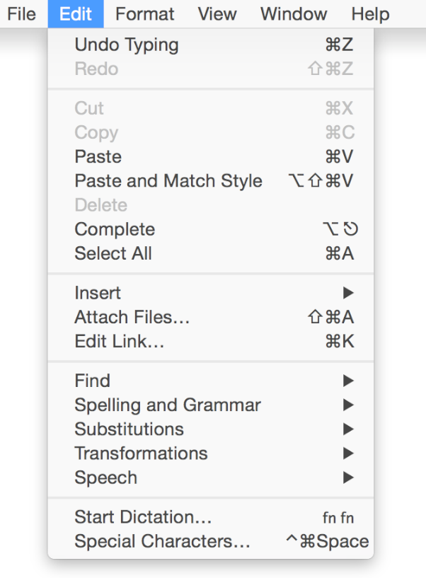
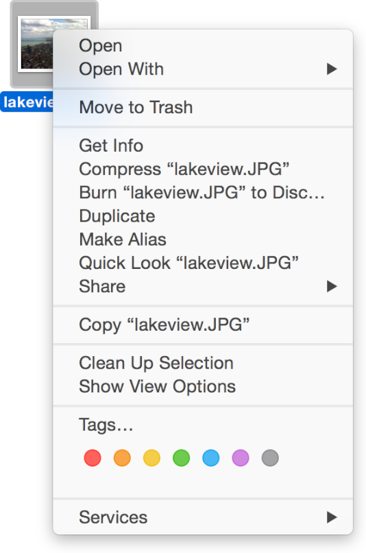
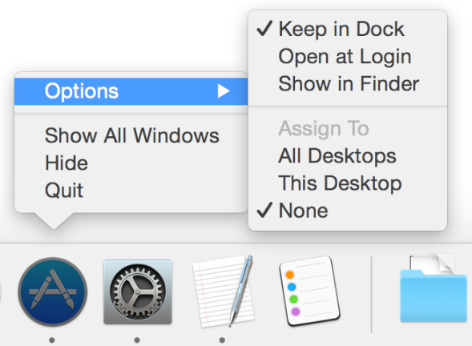
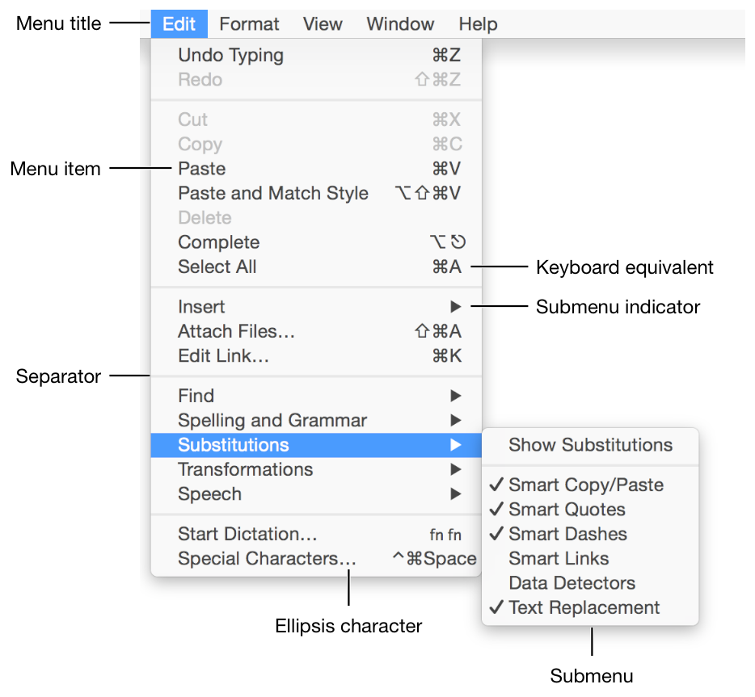

## 关于菜单

菜单用于展示用户可选的项目列表，这些项目可以是命令、属性或者状态。OS X 的菜单有以下几种不同的形式：

**菜单栏里的菜单**出现在屏幕顶部，用于展示当前应用可以执行的命令。典型的应用一般会在一个菜单栏里面放置多个菜单。关于菜单栏的简介，可以查看[菜单栏里的菜单 Menu Bar Menus]()一章。

**上下文菜单**可以显示当前选中对象相关的选项。用户可以在屏幕上的某个区域，或者选中的对象上使用 Control + 鼠标单击来打开上下文菜单。

**Dock 菜单**包含了系统定义的选项（比如在 Finder 打开和固定到 Dock）和应用自定义的选项（比如在新窗口打开）。用户可以 Control + 鼠标单击或者长按 Dock 图标来打开这个菜单。

Yosemite 系统里所有形式的菜单默认都会用上 vibrancy 效果。

	注意
	悬浮菜单和下拉菜单这两种控件也可以显示菜单（关于这些控件的更多信息，可以参考[菜单控件 Menu Controls]()）。因为这些控件跟应用菜单有一些共性，所以关于菜单的指南也适用于这些控件。

### 菜单剖析

一个菜单至少会包含一个选项列表。大多数菜单还会用不同的标题区分不同类型的选项。菜单还有一些可选的部件，比如快捷键、子菜单、开关、分隔线、图标和符号（比如对勾）等等。下图所示是系统文本编辑器（TextEdit）的菜单，这里没就包含了一个选项列表，一个标题（“Edit”），多个键盘快捷键，子菜单，以及区分不同选项组的分隔线。

一个菜单栏菜单可以包含上面所有的部件，但不是所有的部件都适用于所有菜单类型。比如上下文菜单就没有标题，因为上下文菜单的内容是跟用户当前的选择相关的。关于上下文菜单的更多信息，可以参考[上下文菜单 Contextual Menus]()一章。

### 菜单行为

所有的菜单都会执行一个明确动作：用户确认需要执行什么动作，然后从菜单项列表里选一个来执行。（关于明确动作更多信息，请参考[明确动作和隐含动作 Explicit and Implied Actions]()）。

为了选中一个菜单项，用户需要先打开菜单，再把鼠标移动到目标选项上。鼠标经过的每个菜单项都会高亮，自动打开子菜单（如果有的话）。在用户选中菜单项之前，不会执行任何动作。这种菜单行为使得用户可以在不触发动作的情况下浏览菜单，找到自己需要的菜单项。当用户选中某个菜单项的时候，这个菜单项会快速闪动，告诉用户菜单项已经被选中了，然后执行对应的动作。

用户打开一个菜单后，除非有别的动作导致它关闭，否则菜单会一直显示在那里。这些动作包括：

- 选择菜单里的某个选项
- 把鼠标移动到菜单栏的另一个菜单标题上
- 在菜单外单击鼠标
- 系统弹出了警告
- 系统切换或者关闭了当前应用