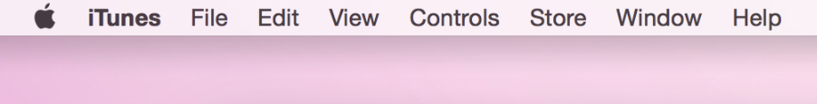

## 菜单命名规范

### 一个菜单标题表示一组选项

除了像“文件”、“窗口”这样的系统菜单之外，很多应用还会往菜单栏里面增加应用自己的菜单，以提供给用户更多有用的选项。而用户会打开那一个菜单列表则取决于菜单的标题，所以菜单标题的命名是否准确就成了至关重要的因素。举个例子，iTunes 的 Controls 和 Store 菜单就很明确地区分了这两种类型的菜单，用户看标题就可以猜到这两个菜单对应的内容会是什么。

	注意
	上下文菜单和 Dock 菜单没有标题是因为用户打开这些菜单的时候一般是已经选中了某个图标或者窗口内的某个区域。关于这类菜单的更多内容，可以参考[上下文菜单 Contextual Menus]() 和 [Dock 菜单 Dock Menus]()。

	悬浮菜单和下拉菜单一般情况下也是没有标题的，但是这种菜单有必要的时候也可以把其中一个菜单项或者一句简介作为标题显示。关于这类控件，请参考[菜单控件 Menu Controls]() 一章。

菜单标题的命名请遵循以下规范：

**菜单标题要能准确描述所包含的选项。**要做到让用户只看标题就能估计自己要用到的选项会不会在这个菜单列表里面。比如，用户觉得“字体”菜单就该包含各种字体的名字，比如“Helvetica”和“Geneva”字体，但是编辑用的命令出现在字体菜单里面就很奇怪了，像剪切、复制这些，就不应该出现在字体菜单里面。

**在不影响清晰度的前提下，菜单的命名越短越好。**最佳情况应该是只有一个单词（译者注：对中文来说，两个到四个字为佳），一个原因是占地方比较少，零一个原因是用户一眼扫过就能看出是什么内容，便于理解。如果你一定要用多个单词的话，请确保这个命名能遵循标题风格的首字母大写规则。（关于标题式首字母大写风格，你可以参看[使用正确的首字母大写风格 Use the Right Capitalization Style in Labels and Text]()）一章。

**避免在菜单标题上使用图标。**这样用户很容易会把菜单标题和系统菜单栏上的应用图标搞混（即 OS X 系统顶部靠右边类似电池图标的那些应用图标），而且，同时使用图标和文字的形式也是不可接受的。

**无论什么时候都要确保菜单的标题是清晰可读的。**就算所有的菜单项都是不可用的，菜单标题也应该是清晰的。不管菜单项是否可用，用户都要时时可以看到菜单列表的内容。只有保证菜单项无论何时都是可见的（即使是灰色的不可用状态），才能更好地帮助用户去理解这个应用能做些什么。（译者注：所以，并不是“这个功能不可用就隐藏起来不给用户看到”，把这个不可用的功能灰色显示才是更好的选择。）

### 一个菜单项表示一个动作或者一个命令

跟菜单标题一样，菜单项的命名也要做到准确表达内容，让用户可以预测这个选项可能达成的结果。

菜单项的名字表示的是一个某个对象可以执行的动作，或者可以修改的属性。具体地说：

- **动作**一般是动词或者动词词组，用于描述这个菜单项被选中后会做出的动作。比如，“打印”表示“打印当前文档”，“复制”表示“复制当前选中的文本”。

- **属性**一般是形容词或形容词词组，用于描述这个菜单项执行后会带来的变化。菜单项的形容词通常都被可以放进“把当前选中的对象变成……”这样的句子里，比如“粗体”和“斜体”。

菜单项命名请遵循以下规范：

**一般来说，不要在菜单项里面使用定冠词和不定冠词。**由于用户在使用菜单的时候一般已经选中了一些内容，或者正处于某种模式，这时候菜单项里的冠词其实就没什么意义了。比如我们一般直接用“添加帐号 Add Account”，而不是“添加一个帐号 Add an Account”。用“隐藏工具栏 Hide Toolbar”，而不是“隐藏这个工具栏 Hide the Toolbar”。确保你的菜单项的命名风格能够保持一致。

**如果点击这个菜单项之后还有下一步操作，请在后面加上省略号（…）。**省略号表示点击这个菜单项可能会弹出一个对话框，或者一个新窗口，用户需要在新的界面输入一些信息才能完成最终操作。详细信息可以参考[需要输入更多信息的时候，请使用省略号 Use an Ellipsis When More Input Is Required]() 一章。

**菜单项要使用标题风格的首字母大写规则。**关于标题式首字母大写风格，你可以参看[使用正确的首字母大写风格 Use the Right Capitalization Style in Labels and Text]() 一章

**如果可以的话，给常用的菜单项定义快捷键。**对于熟手来说，快捷键是更加高效的执行手段，比如 Command+C 用直接执行菜单的复制选项。再定义你自己的快捷键之前，请先阅读[提供键盘快捷键 Providing Keyboard Shortcuts]() 一文。

**不可用的菜单要灰掉。**用户看到被灰掉的菜单就知道是不可用了。被灰掉的菜单在鼠标经过的时也不会高亮。