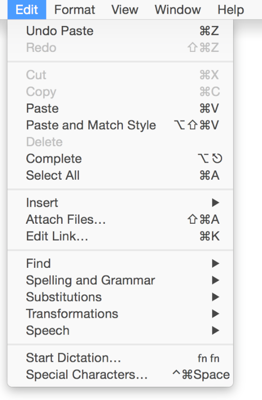

## 菜单项分组规范

把菜单项按照逻辑分组可以让用户更快找到自己需要的命令。通常我们可以参考各个任务的心智模型来决定分组。关于心智模型的概念，可以参考[心智模型 Mental Model]() 一章。

**尽可能创建“正确”数量的分组。**分组的数量应该是多少个，一半由审美决定，一半由可用性决定。系统的文本编辑器应用的编辑菜单（如下图）就是利用任务属性来做分组的范例。

**一般来说，越是常用的功能分组就越靠前。**因为用户一打开菜单列表第一眼看到的就是菜单顶部，所以常用功能要放在最容易看到的地方。但是，不要根据用户使用的频率来决定菜单的顺序，更好的做法应该是把相关的菜单项合成一个组，然后把使用频率更高的分组放在上面，组内的排布不根据频率来排。比如说，“查找下一个”（或者再次查找）的命令通常比“查找…”用更最频繁的，但是它还是放在“查找”下面。

**不要把动作菜单项和属性菜单项放在同一个分组。**用户执行一个动作和选中某个区域然后修改属性这两种行为是截然不同的，所以最好不要放到同一个分组里面去。

**把相互依赖的属性放到同一个分组。**用户的预期是在同一个分组里面可以找到相关的几个属性，这些属性可以是**完全互斥**的（用户只能选择其中一个，比如设置字体大小），也可以是有**累加效果**的（用户可以选择多个属性，比如粗体和斜体）。

**如果需要，可以把相关的菜单项合并成一个菜单。**如果一个菜单重复同一个术语超过两次，就可以考虑分出来一个新的菜单列表，或者子菜单。比如你有“显示信息”、“显示颜色”、“显示层级”、“显示工具盒”等等多个菜单项，你就可以新建一个菜单列表或者一个子菜单，把相同的这几个菜单项都放进去。

**尽量避免菜单列表过长。**太长的菜单是很难用的，用户也会觉得信息过载。如果一个菜单有太多选项，你就要考虑重新分配这些菜单项了。这时候你可能会发现有些选项其实可以分到别的菜单里面去，或者干脆新建一个菜单来放置这些选项。你也可以考虑创建一个子菜单，不过子菜单也不是适用于所有情况的。关于子菜单的指南，可以参考[层级菜单 Hierarchical Menus]()一章。

要注意有些菜单用户是可以往里面添加选项的，这可能会导致菜单列表变得很长。比如 Safari 的历史菜单，如果用户浏览过很多网站就会产生很长的历史列表，这时候我们可以使用滚动条让菜单可滚动，然后在底部加一个向下指的三角形，这样菜单就变成了**滚动菜单**。不要轻易使用滚动菜单，滚动菜单只有在菜单项过长的时候才能出现，比如用户自定义的菜单，或者这个菜单的选项会由于某种原因增长的，比如“窗口”菜单，打开着多少个窗口，这个菜单就有多少个选项。