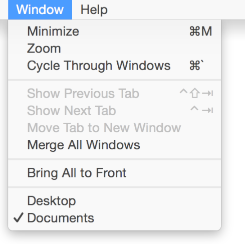

## 修改一个菜单项

有时候我们可能需要根据用户不同的动作修改某个菜单项的展示。OS X 提供了两种方式来修改菜单项：动态菜单项和开关菜单项。

### 动态菜单项

**动态菜单项**会在用户按下不同的修饰键（译者注：Modifier Key，按下时可以临时修改其他按钮的动作，比如 Shift 和 Ctrl）而做出相应的改变。比如系统的窗口菜单，当用户按下 Option 键的时候，最大化和最小化会变成“全部最大化”和“全部最小化”。

	注意
	在代码里面定义一个动态菜单项，你可以使用 NSMenuItem 的 setAlternate: 方法。

使用动态菜单项的时候，请遵循以下指南。

**避免让动态菜单项成为唯一可以执行这些任务的方法。**动态菜单项是默认隐藏的，所以对于高级用户来说这是一种快捷方式。在用户还没能高效使用一个应用之前，不要让用户发现动态菜单项的存在。比如说，用户没有发现“最小化全部窗口”这个动态菜单项之前，他们还是可以逐个把每个窗口最小化。

当然你也可以在 Dock 菜单或者上下文菜单里面使用动态菜单项，不过这些地方就更难被用户发现了。所以对于应用菜单来说，这些上下文菜单和 Dock 菜单的功能应该有其他的替代入口，不能依赖于用户自己去发现这些菜单。

**只用一个修饰键来显示动态菜单项。**如果用户在打开菜单的时候，还要同时用上两个以上的修饰键就太难了。而且，两个以上的修饰键要大大减少用户发现动态菜单的机会。

	注意
	OS X 会自动根据最长的菜单项来调整菜单宽度，包括按下 Option 才能出现的那些菜单项。

### 开关菜单项