# 001 UI 设计基础

## 为 Yosemite 设计

人们喜欢 Mac 操作系统 (OS X)，因为它提供了所有用于创作，管理和体验的所需的工具与环境。一个优秀的 Mac 应用可以在无缝接入系统，同时提供个性化的功能和体验。

在进入文档内容之前，我们不妨先来看看 OS X 是怎么从简化、统一和层次(Simplicity, Consistence and Depth)三个方面，营造一种关注于内容的用户体验的。

首先，OS X 为了突出核心功能，弱化了很多界面造成的影响。比如 Yosemite 就对很多系统应用的图标都做了减法，在保留优雅与易于辨认的基础上去掉一些不必要的装饰。

Yosemite (10.10) 的日历图标

Mavericks (10.9) 的日历图标

至于系统字体，则采用了苹果优化过的 Helvetica Neue。这种字体使得整个系统展示的文字更加优美，也更加清晰。

还有窗口标题栏，新的系统把标题栏与工具栏整合到一起，即保留了原有的功能，也让界面更加清新。

总而言之，Yosemite 的界面使人眼前一亮，而且沿袭了苹果一贯的风格，使用户感觉宾至如归，不会太过跳跃。而这，就要归功于苹果统一的设计风格了。

比如系统图标的设计风格，是在和谐与稳定之间找到一种平衡。主要有两类风格：

写实风格：Preview, Mail, Photo Booth 和 Dictionary 这些系统应用的图标都使用了这种风格。这些图标在细节，透视，光源以及渲染风格上达成统一。

图形化风格：iTunes, iBooks, App Store 和 Safari 则采用了圆形抽象图标的风格。这些图标里的符号都采用了同样的压花效果，并且统一了所有图标的轮廓形状和颜色搭配。

使用优化过的 Helvetica Neue 作为系统字体意味着统一了操作系统和应用文本的显示效果。而且使用这种字体还可以跟 iOS 的体验保持一致。用户可以在 iOS 和 OS X 之间流畅地进行切换。

OS X 的提醒事项

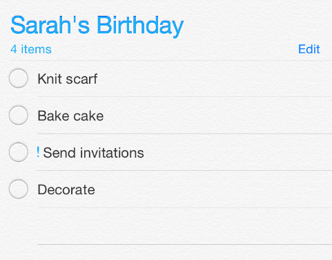
iOS 的提醒事项

Yosemite 在物理维度上提炼、细化、完善了视觉效果。具体来说，Yosemite 采用了半透明 (Translucency) 与模糊 (Vibrancy, 直译为振动并不达意，以下直接以英文代称) 效果，使界面更加扁平化，使用户更专注于的内容。(Vibrancy 是一种优雅的渲染效果，这种效果会自动吸取当前视图底下一层内容的颜色作为当前背景。)

如下图，阴影，半透明和 Vibrancy 效果让激活窗口跃然纸上，一下就抓住了视觉的焦点。

半透明的工具栏弱化了窗口的存在感，更突出内容。

侧边栏和遮罩分别使用了两种不同的 Vibrancy 效果来突出内容。

如果是用于应用内导航的侧边栏，比如 Finder，则让 Vibrancy 透过窗口显示后面的内容。

如果是用于提供选项和控制当前窗口内容的遮罩，比如说地图应用的导航视图，则让 Vibrancy 透出遮罩层下面同一个窗口里的内容，这样可以给用户一种更为广阔的视野，不会因为内容被遮罩层挡住感到界面太狭窄。

系统的通知中心使用了深色 Vibrancy 效果，透出底下的内容，让用户在打开通知中心的时候能留在当前的使用情境，不会太跳跃。

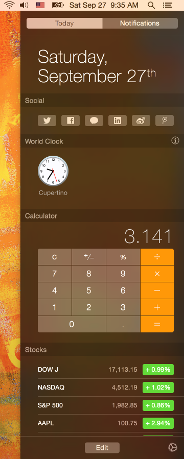

译者注：那么总的来说我们可以说 Vibrancy 的好处有四点：

1. 吸引视觉焦点
2. 暗示功能地位（透视的内容不同意味该界面的功能级别不同）
3. 拓宽视觉广度（界面不觉逼仄）
4. 延续当前情境

## 应用风格剖析

总的来说， OS X 的应用有三种风格。（译者注：这个总结比较空泛，相比起 iOS 严格的设计规范，OS X 要自由得多，这也导致 OS X 应用的设计各式各样，不尽相同。）

1. 单窗口工具型

比如系统的计算器和字典应用，所有的任务都在单一窗口里面完成。其中关于、设置之类虽然是另一个窗口，但他们都是辅助信息，用户最主要是关注的还是主窗口。

2. 单窗口“鞋盒”型

这种类型应用一般会提供在应用内查看和管理内容的功能。比如说 iPhoto(译者注：原文没有明指，但是看起来 iPhoto 应该符合这种类型)，用户并不希望在 Finder 里面逐个找到自己拍的照片然后再打开另一个应用来处理这些照片，于是，iPhoto 这样的应用就提供了可以在同一个应用里查看，管理和编辑照片这样的功能。

3. 基于文档的多窗口型

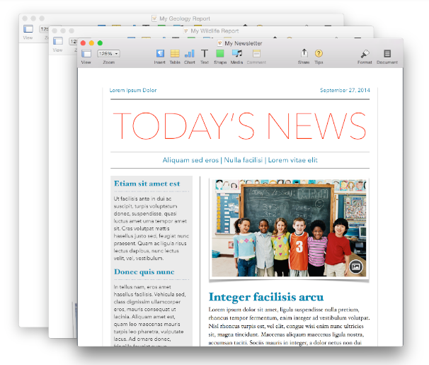

比如说 Pages，每一个文档对应一个新窗口，用户可以在不同的窗口里面查看、编辑不同的文档。这种应用一般会有一个主窗口作为应用的入口。(这个主窗口不一定是主要使用场景，也可以是一个设置面板，或者辅助窗口，比如 iA Writer 启动的时候就只展示一个文件选择器。)

但是不管哪一种风格都好，所有的 OS X 应用的入口都只是窗口或系统菜单栏。窗口可以是一个或多个，菜单栏也可以根据不同的应用提供不同的功能。

苹果提供的 AppKit 框架定义了窗口、菜单、控件和其他界面元素。同时 AppKit 也提供了一些应用级别的特性，比如说手势识别，字体管理，图像处理，辅助功能以及语音识别等等。此外， Yosemite 还定义了深、浅两种 Vibrant 视觉效果，你可以在代码里面用 NSVisualEffectView 来实现。

抛开技术细节，从广义上看，AppKit 提供的界面元素可以分为以下几类：

- **窗口(Windows)** 窗口构成应用内容展示的框架。
- **菜单(Menus)** 菜单包含了用于控制这个应用的各种命令，比如说编辑菜单项，里面就包含了复制、粘贴等各种编辑命令。
- **内容视图(Content Views)** 内容视图是用来展示内容的，比如说文本视图，悬浮层视图等等，一个视图也可以包含用于管理视图内容的控件。
- **控件(Controls)** 用户会靠按钮，滑动条，多选框等控件来完成输入动作，或者执行一项任务。

为了控制种类繁多的 UI 控件，你需要使用各种不同的控制器(Controllers，下文以英文直称)，比如说窗口控制器，列表控制器和多栏视图控制器。其中最典型就是窗口控制器，一个窗口控制器（Window Controller）往往包含多个视图控制器，而每个视图控制器又可以控制一组视图或一组控件。

故事板（Storyboard，Xcode 提供的以视觉方式编写界面代码的工具，以下以英文直称）就是用视觉效果来展现应用架构的好例子。一个场景(Scene，以下英文直称)表示一个 Controller 及其所管理的多个 View，而一个继续符（Segue，以下英文直称）则表示两个场景之间的关系。这两个场景可以是包含关系（比如一个 Window Controller 包含了一个 View Controller），也可以是展示关系（Presentation，一个 View Controller 可以展示一个悬浮层 Popover 在上面）。

	提示
	如果你也在 iOS 上面用过 Storyboard，那你应该知道 OS X 跟 iOS 不太一样，OS X 的应用一般都很少有展示关系，而更多的是包含关系。这种差异说明 OS X 比起 iOS 有更大的屏幕空间可以展示内容，也就是说一个 View 其实没什么必要在它上面覆盖另一个 View，多数时候可以直接展示在同一个平面里。

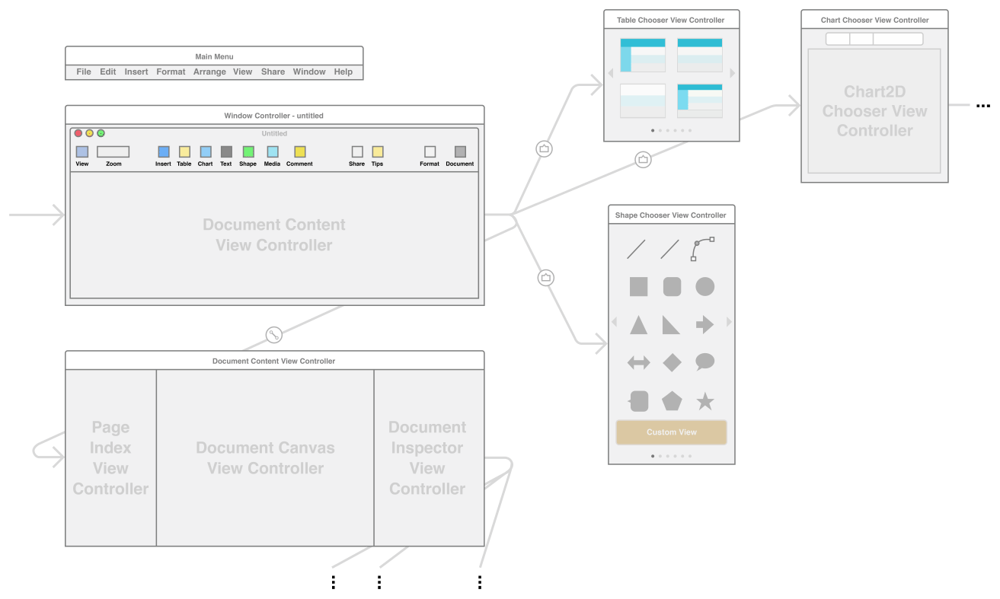

## 启动与关闭

### 快速启动

用户希望安装了你的应用立刻就可以用，所以为了符合这种“即装即用”的心理预期，你应该注意以下几点：

- **避免让用户输入繁冗的安装信息**

	在安装阶段，尽量避免让用户输入大量的安装信息。如果是用户已经提供过的信息，比如系统设置和通讯录里面有的，就不要让用户再输入一次了。如果确实需要，可以在真正要用到的时候才让用户输入，而且为了鼓励用户，最好能给用户一点回报。

- **对于欢迎页的使用，要思之再三**
	
	欢迎页 (Onboarding) 指的是用来介绍应用的特性或者教育用户如何使用的页面。在你考虑怎么做一个欢迎页之前，你其实更应该把心思花在应用本身的设计上，把应用的特性做到更加直观易用，而不是用一个欢迎页来引导用户去发现这些新特性。要知道，做得再好的欢迎页也无法替代应用本身，用户真正在用的是 App，不是 Onboarding。
	
	当然也不排除你确实需要一个欢迎页或者教育页的情况，如果是一定要做，就请遵循一下指南，力图给用户一个简洁、清晰的体验：

	- **只给用户必要的信息**

		一个好的欢迎页应该要告诉用户使用这个应用之前有哪些条件是必须具备的，或者只是简单地展示能让多数用户感兴趣的特性。如果在用户还没开始用之前就给了用户太多现在还用不到的信息，反而会给用户留下“这个应用好难用”的印象。如果你的应用有某些操作是需要特别说明的，那你应该等到用户用到的时候再弹出说明，而不是一股脑全扔进欢迎页里面。
		
	- **善用动画来教育用户**

		如果不能切实提升体验，就不要用文字说明。一旦用了文字，则要力求简明扼要，你永远不要指望用户会耐心读完你精心编写的洋洋洒洒三千多字的说明。如果操作比较简单，能用动画做引导的，就不要用文字来说明。如果是操作比较复杂，你可以增加几个简单的文本说明遮罩来做指引。尽可能不要在应用里面使用应用本身的截图，因为截图是不可点不会响应的，用户很可能会把它们跟真正的界面搞混，以为是你的应用没有响应。
	
	- **提供便捷的跳过途径**

		基本上看完欢迎页的人都不会想再看第二遍，有些人甚至根本就不想看到欢迎页。所以一定要有记住用户上一次选择的功能，比如记住“不再展示”，不要让用户每次打开都看到这个页面。

- **默认设置要符合大众习惯**

	应用的默认设置要符合大众习惯，基本上满足大多数人的需求之后，默认设置就很少会被改。

- **应用的功能要足够直观**

	如果一个应用足够直观易用，用户就会从中获得成就感。可能有些操作还是必须要有提示的，但是也别让用户觉得他们得看完一本厚厚的使用说明手册才能开始用这个应用。（关于帮助信息的设计，请参考[帮助信息]()一章。）

- **别让用户重启**

	应用安装完就应该可以用了，如果你的应用安装完还得重启后才能用，那你可得三思了。

### 要时刻准备好应对关闭和重启

大多数用户分不清关闭主窗口和关闭应用之间的区别，所以最好让你的应用在这两种情况下都能表现一致，除非是用户注意的情况，比如完全关闭应用会导致关键功能失效，这时候得给个提示。下面我们来谈谈怎么在打开和退出应用时给用户提供一个良好的体验：

- **考虑用户是否需要知道你的应用已经被关闭了，**如果你的应用只有一个窗口，那么可以在关掉这个窗口的时候就退出应用。

- **重新打开应用时应该保持上一次退出时的状态。**在退出前保存用户修改过的配置，比如说窗口的位置和大小，下次打开的时候就可以出现在同个位置，更符合用户的心理预期。OS X 10.7 以上开始支持 Resume 特性，可以帮你保存当前窗口的状态，下一次打开的时候就可以自动恢复了。详情请参考[用户界面状态保存]()和[Mac 应用编程指南]()。

- **提供自动保存和版本控制。**用户都希望当前编辑的内容能够自动保存，所以如果你的应用是用来创建和编辑文档的，请一定要支持自动保存。（更多自动保存的技术细节，请参考[自动保存与版本控制]()）

## 模态

模态是用来展示或者体验某种事物的一种模式。(原文：Modality is a mode in which something exists or is experienced. )模态可以给用户提供一个专注完成某件任务或者获取某些信息的途径，但是模态也会让用户暂时无法和应用其他部分的界面进行交互。（译者注：原文解释得有点拗口，简单地说，一个警告框就是一种模态，在关闭警告框前其他的界面是无法响应用户的操作的。）

所以，作为一个设计师，你要做的就是权衡模态的利弊，让用户既能专注内容，又不会太受束缚。

举个例子，当用户在系统的预览应用 (Preview) 里面使用涂鸦 (Sketch) 功能的时候，用户是不能选中或编辑文本的。

**只在必要的时候使用模式。** 举几个例子：

- 需要用户关注重要警告的时候
- 必须完成一些任务才能进行下一步的时候。
- 一定程度上，当前在做的操作本身就是模态的。比如说正在使用画图软件的笔刷，或者在文档编辑器里面修改字体等等。

**请慎重考虑需要用户频繁进出模态的设计。** 一般情况下，不要频繁打断用户当前的操作，也不要用滥用分散无关的模态操作，这些都会带来不完整的体验。要尽可能把模式用在能够被用户一口气完成的小任务上面。

**少用模态和用户需要专注之间，要做好权衡。** 有些时候用户更希望有一个独立专注的环境来完成某些特定的任务。为了满足这种需求，你就得设计一种既能实现隔离又能无损体验所有功能的模式。但是你不能简单地让用户进入一个模式获得某种信息，然后再切换到另一个模式去做另一件事，这种复杂的切换操作用户是不会买账的。最好的情况是让用户无论在什么时候都能够体验到所有的功能，所以除非模态用在这里很有价值，否则轻易不要用模态。

**模态影响的范围越小越好。** 举个例子，如果是一个文档窗口需要用到模态，那么就应该针对那个文档的使用模态框，这种模态框也叫 Sheet（译者注：比如 Pages 的打开文件的选择窗口）。Sheet 可以阻止用户与当前窗口其他部分的交互，但是不会影响这个应用的其他窗口。详情请见[对话框]()一章。

**明确指示出用户当前所处的模式。** 要让用户一眼就能看出是处于什么模式。比如说，画图软件可以用不同的指针样式来代表不同的模式，比如笔刷指针代表绘画，橡皮擦指针代表擦除等等。使用分隔控件（Segmented Control）也可以告诉用户当前是处于什么模式。比如说 Finder 的工具栏里面的 Segnmented Control 就可以指示当前视图是处于图标模式，列表模式还是多行模式。使用浮动层（Popover）来展示一项独立任务则可以给人较强的视觉提示。更多关于浮动层的内容，可以参见[浮动层]()一章。

**要能很容易地退出一种模式。** 必须要提供很容易就能离开当前模式的方法，比如说，你可以显示一个浮动层，当用户点击浮动层以外的区域时就自动关闭（比如 iMessage 的表情面板）。同时为了防止误操作退出了当前模式而丢失数据，必要的时候你还得提供保存当前设置的功能。

**不要滥用警告框。** 只在必要的时候才弹警告框，尤其不要用警告框来展示无法交互的内容（译者注：比如完全没有退出按钮的警告框）。一个警告框应该要把问题描述清楚，解释为什么会出现这种问题，并且提供下一步操作的选项（译者注：比如没网络的警告框就有“选择网络”的按钮）。真的出错的时候，你还得防止用户数据丢失，要在警告框里告诉用户可行的备选方案。关于如何创建一个好的警告框，请参见[警告框]()一章。

## 协作性

具有协作性的应用可以无缝地接入其他应用，直接使用其他应用的功能。这就意味着用户可以不再理会应用层面的细节，只要关注内容就可以了。

**接入系统扩展和服务。** 当用户在你的应用里执行一项比较重的任务的时候，他们更希望通过扩展（App Extensions）来实现一些特定的任务。比如说，用户在文本编辑器（TextEdit）里面如果想插入一张图片，可以选择菜单里的服务选项，调起其他的应用来选择图片。

当用户想编辑这张图片的时候，可以直接在 TextEdit 中用系统集成的 MokUp 应用来编辑。

**接入 HandOff。** Handoff 可以让用户把在某部设备上正在做的事情，无缝转移地到另一台设备继续工作。由于 Handoff 是基于“用户当前正在进行的任务”这个概念来设计的，所以首先你得定义好哪些任务是需要做无缝切换的，关于 Handoff 更多内容，请参考 [Handoff 编程指南]。

**尽量不要用自定义的文件格式。** 相反地，要多用标准文件格式，这样用户可以使用多个应用打开同一个文件，各个应用之间也可以很方便地交换数据。如果你一定要用自定义格式，那请确保你提供了导入导出功能，可以把你定义的格式转换为通用的格式，这样用户才能方便地把你的文件分享出去。必要的时候，你还得做好系统 Quick Look 数据的转换，确保你的文件能够被 Finder 和 Spotlight 预览。更多关于 Finder 和 Spotlight 的信息，请参见 [The Finder]() 和 [Spotlight]()。

**避免让用户关注你的文件格式。** 最佳的做法是用户完全不需要关心你的文件是什么格式的（要知道，Finder 的设置项里面是可以隐藏掉文件扩展名的）。一般来说，用户期望你的应用可以打开其他应用创建的文档，而你的应用创建的文档又可以被分享出去在别的应用里正常打开。所以，你在保存文件的时候要能够根据不同的文档内容选择对应的文件扩展名。但是与此同时，在你的应用里面显示文件扩展名的时候，要尊重用户的设置，如果用户设置了隐藏扩展名，如过不是必须强调的地方，就不要显示出来了。

**在所有平台使用同一个文件格式。** 使用同一种文件格式可以让用户在所有平台都能用你的应用来打开你的文件，而不需要去关心他们用的是什么设备，什么平台。

**不要省略文件扩展名。** 所有平台都可以通过文件扩展名来判断这个文件的类型。尽管 OS X 的用户可以隐藏文件扩展名，但是你在保存文件的时候还是要有文件扩展名的，这样其他平台才可以通过扩展名来判断用哪种方式去打开你的文件。

**使用用户默认系统（User Default System）来保存用户设置项。** 使用系统提供的 User Defaults System 生成的设置项会被写进一个 plist 文件里面。你可以用 [NSUserDefaults]() 对象来获取和修改这些设置信息。详情请参见 [NSUserDefaults Class Refrerence]()。

**使用标准协议做数据交换。** XML 格式应用广泛，也是跨平台的数据格式，这里首推 XML 格式。

**在 IP 网络中，你可以使用 Bonjour 自动发现同网中的设备和服务。** 千万别让用户输入 IP 地址，或者设置 DNS  地址。（译者注：面向普通用户的应用如果还要手动输入 IP 和 DNS，估计没几个人用的了。）

## 反馈与帮助

### 让用户了解进度

一个应用应该除了要响应用户的指令和动作，还得告知用户一个任务的执行需要多长时间。如果你的应用没有很好的进度反馈，那用户可能会认为你的应用死掉了，没响应了。

**即时响应用户的指令和输入。** 用户希望在与应用交互的过程中能够得到持续的反馈，比如 OS X 的按钮就能够在用户点击鼠标的时候给出视觉反馈，鼠标指针也会在进入不同的控件或者区域的时候有不同的样式。同样的，如果一项任务要花比较长的时间来完成，这时候用户需要知道为什么这个任务没法立刻出结果，而且要知道他还可以做什么。对用户的动作反馈得越快，给用户的感觉就越流畅。更多关于反馈的设计原则，请参见[反馈与交流]()一章。

	提示：
	动画可以很好地告知用户他们能做什么，以及他们的动作能带来什么影响。关于动画，请参见[动画]()一章。
	
**不要等到一项耗时较长的任务完成后才展示结果。** 如果在任务完成前一直展示空白，就会让用户感觉你这个应用太慢，太迟钝了。所以，你应该要一边执行任务一边展示已经得到的那部分结果，这样用户可以在任务完成前先获得一部分有用的信息。（译者注：比如实时搜索，搜到的结果先展示，没搜到的继续保持加载状态，等到全部搜完了才出现所有结果。）

**使用指示器来帮助用户估算剩余时间。** 并不是每一项任务都需要给出精确的预估时间，但是多数情况下还是要给出大概的剩余时间的。比如 Finder 的复制功能，就同时使用了进度条和文字说明来告诉用户还需要多长时间来完成复制。

**对于可能产生意外而造成数据丢失的危险操作，一定要发出警告。** 这种警告是必须的，但是不能太频繁，否则用户就会习惯性忽略这种警告了。但是如果用户很明确就要做删除操作的，数据丢失就是用户所期望的，这种时候就不要给出警告。比如 Finder， 在用户删除文件的时候就没有弹出警告，因为用户本来就要删掉这些文件。关于如何在应用中使用警告，请参见[警告]()一章。

	提示：
	如果你的应用有一个前台线程用来展示界面，一个后台线程用来处理各种主要逻辑，你要确保跟用户所有的交互都是由前台界面线程发起的。因为用户可能并不知道后台线程的存在，如果后台线程突然跑出来一个弹框用户就会觉得很迷惑。所以如果一个后台线程必须跟用户交互的时候，应该要启动前台线程，把主窗口激活然后再做下一步界面展示。（译者注：iOS 所有的界面刷新动作都必须在主线程做，否则无效。）
	
### 有些时候，用户需要帮助信息

理想情况下，用户不需要阅读说明书就可以轻松地使用你应用，但是现实是当用户需要使用高级功能或者较为隐蔽的功能的时候，所以我们还是需要一些帮助信息来告知用户这些复杂功能的用法。下面一节主要讲怎么在不妨碍用户操作的同时做好帮助信息。关于帮助的更多信息，请参考[辅助功能]()一章；关于欢迎页的设计，请参考[快速启动]()一章。

**多数时候我们可以用悬浮标签来指示一个控件的用法。** 当鼠标在控件上悬停数秒后，可以弹出悬浮标签，这个标签包含了由一个很小的浮动视图和一个简短的说明组成（如下图字典应用的标签）。当然理想的做法是让控件设计到一眼就能看出是用来干啥的，但是这种悬浮标签既展示了提示，又不影响使用，也不失为一个提供帮助信息的好办法。由于悬浮标签的说明比较简短，同时也是跟一个控件绑定在一起的，所以这种控件就不太适于用来提示更加复杂的操作。

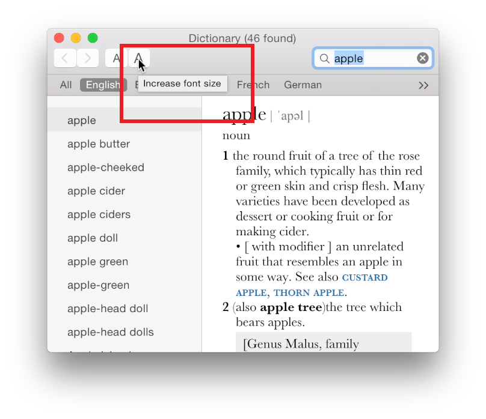

**所以更复杂的操作，我们可以提供帮助文档。**当然你也可以在帮助文档里面提供某个控件的具体用法，不过鉴于多数用户都希望从帮助文档里面找到高级任务的指引，你还是从复杂任务的角度来编排这份文档比较好。

**多数情况下，都要避免限制用户的操作。** 除非你做的是一个儿童应用，有个家长监控模式来限制儿童用户，不然还是要尽量避免不必要的限制。

## 输入和响应

### 支持键盘操作

有些用户可能更喜欢鼠标操作或触摸板操作，但是所有的用户都不可避免地要用到键盘，其中需要语音辅助（VoiceOver）的用户就更是完全依赖于键盘了。

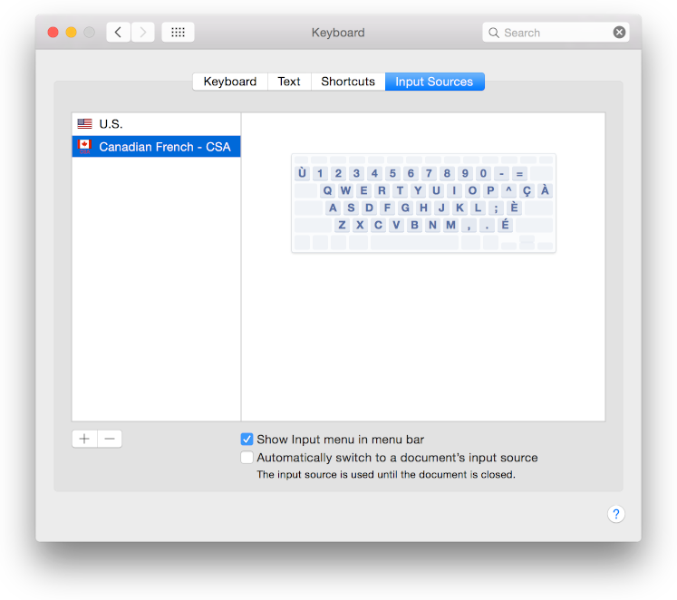

	提示
	OS X 还提供了全键盘控制模式，可以在窗口和对话框直接自由切换。如果用户打开了这个模式，则其他的快捷键组合默认会被保留。（用户可以在键盘设置项里面打开这个选项。）
	
**要提供给用户纯键盘的备选操作。** 比起使用鼠标和触摸板，很多用户更喜欢全键盘操作，其中尤以语音辅助使用者为甚。通常纯键盘操作有两种实现方式：

- 第一种是在系统自带快捷键的基础上，增加一些应用独有的快捷键。
- 第二种则直接让应用的所有控件都支持系统的全键盘控制模式，这样用户就可以只用键盘在所有控件直接自由切换了。

**要避免覆盖用户熟悉的系统快捷键。** 用户希望这些快捷键在不同的应用都有相同的效果的。标准快捷键列表请参见[Table 68-3]()，其中没有苹果标识（如下图）的就是标准快捷键。（译者注：苹果标记表示苹果推荐的快捷键组合。）

### 善用手势可以增强用户体验

触摸板提供了移动指针与激活控件的另一种途径，OS X 还支持多点触控技术，用户可以通过触摸板手势调出 Misson Control 界面，在不同的桌面间切换，或者在应用内滑动返回上一个页面。用户期望这些常见的手势能在整个系统保持一致，包括自带应用和下载应用。

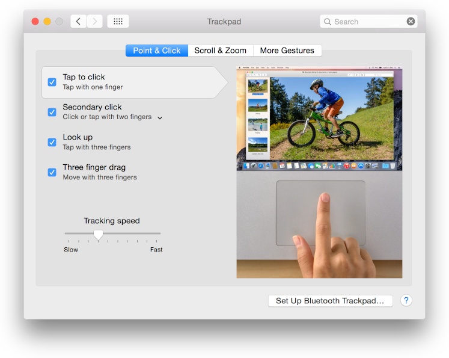

**关注手势的目的，而不是其物理实现。** 换句话说，手势设计应该要针对“返回上一页”这个需求，而不是针对三指滑动这个动作。因为用户是可以修改系统手势的，返回上一页不一定就是三指滑动，但是一旦触发“返回”对应的手势，所有的 App 都要正确响应，不管是图片浏览器，文本编辑器还是网页浏览器。

**避免覆盖系统定义好的手势。** 即使是在游戏这种大量使用自定义手势的场景下，用户也希望能够用系统定义的手势来进入 Misson Control，或者切换桌面。（要知道用户是可以修改触摸板各个手势对应的动作的。）

**要即时响应手势，越灵敏越好。** 手势用来执行轻量级的任务，这样才能给出即时的反馈，提高用户的操控感。

**确保被手势影响的界面粒度适宜。** 一般来说，当手势只作用于一个窗口里的某个视图或对象时是最高效的，因为这些视图通常都是用户焦点所在。所以手势应从用户最关注的视图开始，只有确实必要的时候才让手势作用于更为复杂，可能包含多个视图的对象上。

	提示
	OS X 支持智能缩放手势（两指在触摸板上双击）。只要你定义好内容的布局，NSScrollView 就可以自定放大用户最感兴趣的内容。详情参见[NSScrollView Class Reference]()。
	
**慎重使用自定义手势。** 用户很难去发现和记住自定义手势，如果这个手势意义不大或者很难用，用户可能根本就不用了。如果实在有必要使用自定义手势，请尽量让手势的触发更容易一些，但是得跟用户熟知的手势明显区分，以避免误操作。

### 让文字输入变得更简单

大多数应用都需要文字输入，让输入更加简便无疑是提升用户体验很重要的一环。

**尽可能使用自动补全。** 只要提供的补全信息足够准全，用户是很喜欢使用自动补全功能的。但是如果你无法保证补全的准确率，那最好还是不要硬来。如果你提供了自动补全功能，最好补全的内容和用户输入的内容在视觉上有所区分（可以高亮显示补全提示）。这里要注意密码输入框是绝不允许自动补全的。（译者注：OnePassword 或者浏览器保存密码算是个例外，通常情况下密码还是为空的好。）

**用户输入的时候要提供自动校验功能。** 举个例子，如果一个输入框只能输入数字，那么当用户输入字母的时候就应该弹个提示。校验可以避免很多不符合预期的数据带来的错误。更多关于文本输入框校验的讨论，请见[在对话框中接受用户的输入]()。

**必填项的提示应该在用户离开当前场景而且没对必填项做处理的时候才出现。** 提前在每个必填的文本框里面放置一个星号或者警告图标会让你的界面看起来杂乱无章，毫无吸引力可言。更优雅的做法应该是假设用户会填好所有的必填项，如果焦点离开输入框时是空的，就在那个空的输入框展示提示。这种做法让你可以既保持界面的美观，又不会让用户感觉被当做小孩一样对待。

**在用户输入密码的时候要注意保护用户隐私。** 通常我们使用点符号来表示用户输入的字符。如果用户删除一个字符，输入框里的点符号就会被删掉一个，同时把光标前移。双击点符号可以全选输入框，但是不允许复制。如果焦点离开了输入框（比如按下了 Tab 按键），点符号的数量也应该做点改变，这样可以防止通过点符号的数量来判断用户的密码长度。

## 动画

OS X 使用优美且有意义的动画作为反馈，让用户感知操作的结果。如果你用的是系统的控件，系统已经自带动画了。如果你想自己做动画，那你应该以提升认知清晰度和沟通流畅度为设计目标。

举个例子，如果用户在 TextEditor 里面复制了一个文档，复制出来的副本就会从原来的窗口跳出来，创建一个新的窗口，并激活该窗口。

**避免没有必要的动画。** 不必要或者不合逻辑的动画会很快让用户感到厌恶甚至烦躁。所以你得确保加上去的动画效果都是为了加强用户对功能的理解而设计的。

**不要让动画喧宾夺主，抢占用户太多的关注。** 除非你是在做一款游戏，你可以用各种美妙的动画来吸引用户。但是对与普通应用来说，过多的动画效果反而会分散用户的注意力，得不偿失。最好的动画效果应该在不过分引人注意的前提下帮助用户更好地理解应用。

**利用动画告知用户当前操作可能造成的影响。** 在用户还没真正执行这个操作之前就先展示结果可以让用户树立信心，同时避免犯错。举个例子，当用户把一个图标拖到 Dock 上的时候，其他的图片都会让开空出一个位置，让用户知道当他松开鼠标的时候这个图标会放在哪里。

**当窗口进出全屏模式的时候，可以使用动画做过渡。** 通常系统默认的过渡效果已经够用了，但是如果你的应用有些自定义控件在默认动画下效果不佳的时候，你可以自己设计一个更平滑的动画。比如说，假设在工具栏下面有一个附属工具栏（比如收藏夹），这时候就要确保收藏夹的在全屏动画过程中要一直贴在工具栏下面。

**多用逼真的物理效果。** 有时候逼真的物理效果甚至比逼真的图像要管用。举个例子，OS X 就使用回弹效果（rubber band effect，橡皮圈效果）来告知用户现在已经滚动到窗口的底部了，或者已经滚到最后一个桌面了。把物理效果用在界面上可以让你的用户更容易理解发生了什么。

**利用动画来展示一个 UI 元素的状态变化。** 当 UI 元素从一种状态转到另一种状态的时候，可以用动画来做过渡。这样可以让用户更好地理解界面上发生了什么，能给人一种更好的控制感。（译者注：比如说 VPN 连接的时候，有连接中，校验中，已连接等几种状态，OS X 就使用动画对其状态的变化做了过渡效果。）

**当一个操作快到用户看不到的时候，可以用动画来让用户察觉到这种变化。** 比如说窗口的最小化，对机器来说就是一条指令的事情，但是窗口如果突然消失，对用户来说是无法理解发生了什么的。所以我们可以用流畅的缩小动画（译者注：OS X的窗口最小化效果被称为 Genie Effect）来作为过渡，帮助用户理解这一行为。 

**避免在常用的系统控件上做动画。** 用户早就熟知这些系统控件的行为，如果每点一次按钮或者切换一次 tab 都要花时间看动画就太烦了。（译者注：如果切换动画足够快其实还是挺好接受的。）

**不要对所有事情都做动画。** 理想很丰满：更多的动画意味着更加清晰的理解和更好的反馈。但是现实很骨感：通常情况下用户根本不用这么多动画来帮助理解。绝大多数的操作都应该以最快的速度响应，而不是把时间花在华而不实的动画上。

## 品牌

一个好的设计应该要把品牌以精妙的方式嵌入应用当中，既令人印象深刻，又不令人感到厌倦。

**确保品牌设计只作为用户内容与主要任务的附属存在，不要喧宾夺主。** 用户用这个应用可不是为了要了解某公司的历史或者这个公司都做了什么别的应用，所以为品牌做的设计要尽量低调。比方说你可以把公司 Logo 的主色调用在这个应用上，也可以在自定义图标里面融入品牌的设计元素。

**努力把应用的品质打造成品牌，而不是把公司的品牌硬塞进在应用里。** 想要做到这点，可以尝试开发一种在应用内外都能使用的通用设计语言。这种设计语言将贯穿产品的配色，造型，说明文字，行为举止，力求给用户一种统一的展现。比如 Pages, Keynote 和 Numbers 就使用了统一的视觉语言，创造了一个非常清晰的应用品牌。

**创作一个令人印象深刻的应用图标。** 一个应用的图标就是品牌元素的核心舞台。如果你的应用来自于一个有名的品牌，或者它本身就代表了一个品牌，那么你应该把这个品牌的视觉元素融入你的应用图标里面。更多关于应用图标的设计指南可以看[图标设计]()一章。

## 颜色与字体

### 在系统定义的界面上要多用系统提供的颜色

系统提供的颜色专为系统界面量身定做，比如菜单和悬浮层的背景颜色会自动使用窗口下面的颜色来作模糊（Vibrancy）效果。比如系统的通知中心就使用了系统提供的文本色（[textColor]()）和控件文本色（[controlTextColor]）这些系统颜色，可以在 Vibrancy 效果下取得很好的显示效果（译者注：比如深色部分背景文本自动变浅，浅色背景部分文本自动加深）。使用系统颜色，你可以不用担心文本在不同环境下的显示效果。

另一个系统颜色应用的例子就是采用了 Light Vibrancy 效果的 Finder 侧边栏，系统自动提取了桌面的颜色来渲染侧边栏的背景和字体颜色。

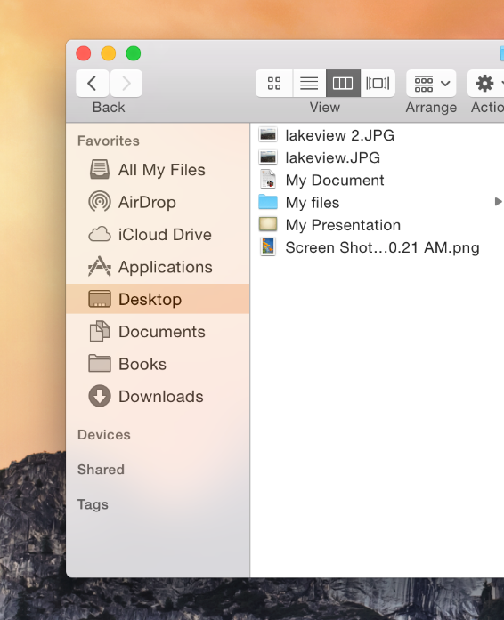

	重要提示
	如果用户修改了系统辅助选项里的“提高对比度”和“降低透明度”选项，系统的颜色可以自动响应这些变化。你也可以通过监听 NSWorkspaceAccessibilityDisplayOptionsDidChangeNotification 这个通知来响应这些变化。

**准备好使用 Vibrancy 效果。** Vibrancy 和半透明效果的影响是全局的，即使是没有用到 Vibrancy 效果的那些应用，也会因为部分系统控件默认使用了 Vibrancy 而被影响到。为了在 Vibrancy 下取得更好的显示效果，你应该多用系统提供的颜色，多用模板图片（Template Image，译者注：模板图片可以对图片的形状自动填充需要的颜色，比如系统菜单栏里的图标，平时是黑色，深色模式下会自动变成白色。），少用自定义的颜色和彩色图片。（如果你不想用 Vibrancy 效果，你可以通过声明 [NSAppearanceNameAqua]() 去掉所有 Vibrancy 效果。）

	重要提示
	模板图片可以使用 Vibrancy 效果，全彩图片则不可以。所以在通常会用上 Vibrancy 效果的工具栏或者侧边栏这些地方，使用全彩图片要先三思了。（更多关于工具栏和侧边栏的信息，请参见[工具栏设计]()和[资源列表]()。）

**用系统颜色来区分不同文本的重要性。**  Yosemite 根据重要性定义了四种等级的系统颜色，虽然这些颜色的命名都带有 label 字样，但其实这些颜色都可以用在非文本界面上。四种颜色的命名如下：

- labelColor （译者注：这是最高级别的颜色，最深）
- secondaryLabelColor
- tertiaryLabelColor
- quaternaryLabelColor

下面的例子展示了这四中级别的颜色在深浅两种 Vibrancy 场景中的效果：

比如系统的邮件应用就使用 labelColor 作为邮件发送者和主题的颜色，以此跟邮件内容做区分。而对邮件来说重要程度最低的分隔线，则使用了 quaternaryLabelColor。

**关注系统颜色的应用场景。** 系统提供的颜色除了 redColor, blueColor 等这些以颜色本身命名的之外，还提供了很多以应用场景命名的颜色，比如说 controlTextColor （控件文本色）和 selectedTextColor (被选中的文本色)。如果你使用颜色的时候能够关注颜色的使用场景，那么即使 OS X 更新了系统的样式，你的应用也还是可以保持和谐的视觉效果。

**关注不同场景下的对比度。** 如果一个视图的前后景没有足够的对比度，就会变得很难阅读。要检查你的应用的对比度是否足够大，有一个不太科学但是挺有效的方法——在不同的关照条件下测试应用里的文字能否看清，比如直接放到太阳光下看看会不会反光之类的。

不过这样也只能帮你找找有哪些可以改进的地方，却做不到更全面彻底的检查。所以，最保险的做法是检查你的前后景两种颜色的亮度比，你可以直接用一些网上提供的亮度比计算器来做计算（译者注：搜一下挺多的，输入两种颜色值自动计算比值），或者你也可以直接通过查 WCAG2.0 标准规定的亮度值再代入公式自己算一下（译者注：[Web Content Accessibility Guildelines](http://www.w3.org/TR/WCAG20/)），理想的亮度比应该要在 4.5:1 以上。

### 应用里的文本都应该清晰可辨

Yosemite 系统提供了一种优化过的 Helvetica Neue 字体，给所有文本提供无与伦比的可辨性，清晰度以及一致性。Yosemite 的这种优化已经权衡过美学与布局上的考虑，所以绝大多数的应用不用做任何改动就能获得很好的效果。而且用了 Auto-Layout（自动布局）的应用，如果一个视图发生了变化，系统还会自动调整字体的显示矩阵，以获得最佳显示效果。

	重要提示
	使用系统字体的时候请用 systemFontOfSize: 或者 boldSystemFontOfSize: 这样的方法，这些指名用 systemFont 的方法返回的就是优化过的系统字体，而定义时指明用 “Helvetica Neue” 的字体系统是不会帮你做优化的。这种指明字体名字的方式可以用在文档编辑里面，但是用在通用界面上的话可能显示效果就不符合预期了。

## 图标与视觉

高质量的视觉设计不仅提升了应用的品质，同时也能传达一定的信息，增强了整体的用户体验。OS X 的用户都习惯了高质量且有意义的视觉设计，他们更愿意使用设计比较优雅的应用。

**所以你要确保你的设计看上去足够专业，足够优雅。**  不要低估这些高质量的视觉设计对用户的价值，渣视觉只能给用户一个很差印象，让用户觉得整个应用的质量都不怎样。为了给用户留下一个不错的印象，在开发的过程中视觉设计必须占有一席之地。

**留心图片在全屏模式下的表现。** 如果你的应用允许使用全屏模式，那么千万不要把直接把拉伸放大，这样图片会变模糊。一般我们可以先从大分辨率开始做视觉设计，然后再缩小成需要的大小，这样会比较科学一点。（译者注：多用 PS 的矢量路径，或者直接用 AI 来做设计会比较好。）

**应用图标要足够惊艳。** 图标是一个应用的名片，投入资源在图标的设计上是很有必要的。你要考虑清楚这个图标是使用拟物风格还是纯图形风格，比如系统的 Garage Band 车库音乐应用就采用了一把非常精致的吉他作为图标。

**如果你采用了现实材料作为视觉元素，那么整个应用都要保持统一的拟物风格。** 通常现实世界存在的纹理可以提高用户的认同感，比如木纹，皮革效果，金属质感或者纸的光感等等，都是比较高级的纹理。要使用这些拟物质感，请尽量遵循以下要求：

- 纹理要足够逼真，足够高级，在任何时候都能保持不错的视觉效果。
- 纹理要和谐融入整个应用的界面，不要生搬硬套。
- 使用纹理的目的在于提高用户体验，帮助用户理解当前情境。如果达不到这种效果，那就是画蛇添足，多此一举了。

**考虑你使用的拟物效果是不是能够帮助用户理解虚拟世界的。** 拟物是为了帮助用户理解，提高可用性，降低学习成本的，如果这个效果帮助用户理解了其中一部分设计，但是却提高了其他部分的认知成本，那就得不偿失了。比如说写信寄信在现实生活中是很常见的行为，但是系统的邮件应用不要增加让用户折信，盖邮戳之类的鸡肋流程。

**没有必要完全照搬现实世界的一切细节，如果调整效果的细节可以让用户更好地理解你的设计，那就放手去改。** 其实是调整或者忽略一些细节是很常见的设计，对细节去芜存菁往往能更好地表达你的想法。

**不要让过多的艺术表达盖过设计的易用性。** 比如说，画一块橡木板，把照片和便签纸钉在上面是个挺不错的拟物效果，但是如果是一个建筑平面图设计软件还用橡木板的形式来展示画板就会显得很奇葩了。也就是说，如果用户看到你的界面还得想一想才知道你要表达的是什么，那这个界面的易用性就算毁了。（这个概念涉及到美学的完整性，可以参见[美学的完整性]()一章。）

## 措辞和用语

文字说明被广泛应用在整个 OS X 系统中，比如按钮的名字，菜单项的说明，对话框里的提示语，帮助标签里的说明等等。如何把文字说明做到清晰易读、风格统一是界面设计中非常重要的一环。

就像应用的图标应该交给专业的绘图设计师来制作一样，应用里的文字说明就应该让专门的写手来做。一个职业写手可以依据你的应用的设计开发一套语言风格，让这种风格贯穿整个应用。

关于苹果特有的术语，写手们可以参考[苹果风格指南 Apple Style Guide](https://help.apple.com/asg/mac/2013/)文档。这篇文档涵盖了苹果的风格规范，专有名词使用规则，以及苹果对语言使用的研究。

对于那些苹果风格指南里面没有覆盖的内容，苹果推荐大家看三本书：《The American Heritage Dictionary》，《The Chicago Manual of Style》，《Words into Type》。如果这几本书的内容有相互矛盾之处，那么关于用法部分请以《The Chicago Manual of Style》为准，拼写部分则以《The American Heritage Dictionary》为准。

### 使用面向用户的措辞

大多数应用都需要通过文字说明来跟用户交流，即使只有按钮上的几个词汇，也属于文字说明的一种。所以怎么对无处不在的说明文字遣词造句就非常重要，要让用户准确理解文字的意思，不要模棱两可，造成误会。

**要尽量避免使用专业术语。**  最重要的是要让用户阅读的时候感到很舒服，不要产生疑惑。如果应用的受众是早已熟知各种技术用语的老手，用点专业术语关系不大，但是如果受众是普通用户，那你最好还是用一些简单的，多数人都能理解的说法。举个例子，系统的家长控制面板就用了很简单直白的语言来描述这个功能。

**避免使用开发者的术语。** 作为一个开发者，你所熟知的一些界面控件的名字可能并不是广大用户能够理解的。所以最好不要在界面上出现这些开发用语。下表列出了一些开发用语和用户熟知的语言的对比，可供参考。

Table 12-1 一些开发用语和对应的用户用语

开发用语 | 用户用语 
----|-----
Cursor | Pointer
Data browser | Scrolling list or multicolumn list
Dirty document | Document with unsaved changes; unsaved document
Error message | Alert message; message
Focus ring | Highlighted area; area ready to accept user input
Control | Button, checkbox, slider, menu, and so forth.
Launch | Start
Mouse-up event | Click
Override | Take the place of; take precedence over
Reboot | Restart
Sheet | Dialog
String | Text
String length | Number of characters

译者注：中英文习惯不同，挑其中几个比较有代表性的列举如下：

开发用语 | 用户用语 
----|-----
控件 | 按钮，滑动条，菜单之类的
鼠标事件 | 点击
字符长度 | 字母个数
模态框 | 警告框

**选择合适的苹果定义的术语。**  如果你需要描述一个标准控件，可以优先选择苹果定义好的一套术语。比如说一个多选框的使用，不要让用户“打开”或者“点击”多选框，而要用“选中”多选框。再比如让用户点击 Dock 上的图标来启动你的应用，这里的 Dock 请一定要首字母大写。[苹果风格指南]()里面会介绍到很多这样的术语。

### 使用简洁的说明文字

说明文字要简洁易懂，但是不要因为空间太小放不下就用含糊不清的说辞。

**对于当前场景下很明显的事情，就不要赘述了。** 比如在一个文档的保存对话框里面，很明显这个对话框是针对当前文档的操作，就没有必要再在说明里面强调是针对“当前文件”或者“当前文档”了。同样的，用户也能理解编辑菜单针对的是当前文档，所以菜单项的命名里面就不要再出现“当前文档”的字样了。

**使用正确的首字母大写形式。** 首字母大写的风格有多种，比如全部单词首字母大写或者除介词外首字母大写。如何正确地使用首字母大写的形式，[正确的首字母大写形式]()一节有详细的说明。（译者注：首字母大写在中文里用不上，但是对于想做国际化的应用来说还是很有帮助的。）

**对于能够打开一个新的对话框的菜单项或者按钮，要在名称后面加上省略号（…）。** 省略号表示用户还需要进行下一步的操作。弹出的对话框的标题应该跟菜单项或按钮同名。更多关于省略号的使用说明，请参考[用好省略号 Using the Ellipse]()一节。

### 正确的首字母大写形式

所有的界面都会用到两种首字母大写形式：标题式和语句式。

**标题式首字母大写。** 除了以下几种单词，其他单词全部要求首字母大写：

- 冠词（a, an, the）
- 并列连词（and, or）
- 四个或少于四个字母的介词。其中介词是名词词组的一部分除外，比如“Starting Up the Computer”，这里 Up 和 Start 组成词组 Start Up。

但是，不论在什么情况下，第一个和最后一个单词的首字母都要大写，不管是不是冠词、连词、介词。

**语句式首字母大写。** 即第一个单词的首字母大写，其他的单词除非是特有名词或者形容词，否则都用小写。

界面元素 | 首字母大写风格 | 例子
---- | ---- | ----
Menu titles | Title |  Highlight Color   Number of Recent Items   Location Refresh Rate
Menu items | Title | Save a Version   Add Sender to Contacts   Log OutMake Alias   Go To…   Go to Page…   Outgoing Mail
Push buttons | Title | Add to Favorites   Don’t Save   Set Up Printers   Restore Defaults   Set Key Repeat
Toolbar item labels | Title | Reading List   Zoom to Fit   New Folder   Reply All   Get Mail
Labels that are not full sentences (for example, group box or list headings) | Title | Mouse Speed   Total Connection Time   Account Type
Options that are not strictly labels (for example, radio button or checkbox text), even if they are not full sentences | Sentence | Enable polling for remote mail   Cache DNS information every ___ minutes   Show displays in menu bar
Maximum number of downloadsialog messages | Sentence | Checking for new software…   Are you sure you want to quit?

### 谨慎使用缩略词

像菜单这种控件，文字展示的空间比较局促，所以只要缩略后的词句没有明显的歧义，就可以用缩略来换取空间。比如说下面这几句缩写：

Don’t Allow Printing （译者注：全称应该是 This document don’t allow printing.）
Don’t Allow Modifying
Don’t Allow Copying

在这个例子中，缩略并没有造成歧义。如果缩略会影响本来的意思，就不要用缩略，比如“contains”和“Does not contain”就是完全不同的意思。

尽量避免使用鲜为人知的缩略，特别要注意以下两点：

- 避免把一个名词和动词混在一起缩略，比如“Apple’s going to announce a new computer today”.
- 避免使用不常见的缩略，比如 “it’ll” 和 “Should’ve”。

译者注：这一小节指的缩略应该是单纯地去掉其中几个单词这样的意思，而下面要讲到的缩写才是把几个单词合并成一个单词这样的意思。

### 只用用户能理解的缩写

缩写（包括提取每个单词首字母的缩写）可以节省界面空间，但是如果用户不理解缩写的意思反而会弄巧成拙。另一方面，有一些缩写比起全称更广为人知，这时如果还非要把全称写上去就会显得过时而且累赘。

为了平衡上述两种极端，我们得谨慎选择更适合目标用户的缩写。考虑是否使用缩写可以从以下几个问题入手：

- 缩写比全称是否更容易理解，更符合习惯？比如，所有人都知道 CD 是光盘（compact disc）的缩写，所以即使目标用户是普通用户也可以使用这个缩写。

另一方面，针对有专业色彩知识的用户设计的应用，可以直接用 CMYK （cyan magenta yellow key，一种印刷色彩模式）这样的缩写，即使有相当一部分人都不懂这是什么意思也没有关系。

- 比起缩写，全拼的单词会不会更鲜为人知？比如大家都知道 Cc 是复印件（carbon copy）的意思，但是今天人们使用的 Cc 已经不是用来表达复印文件这层意思了（Cc 表示邮件里的抄送），如果你还用 carbon copy 来代替 Cc 反而让用户感到困惑。

有些缩写，其准确的全称反而会引起歧义。比如 DVD，全称可以是数字影碟（digital video disc）或者通用数字光盘（digital versatile disc）。由于这种二义性，直接用 DVD 要好过单独使用其中一种全称。

如果你在帮助文档里面用到了一些用户可能不太熟悉的缩写，最好是先声明这些缩写代表的是什么意思。关于帮助文档的相关内容，请参见[用户帮助]()一章。

### 用省略号表示还有下一步输入动作

按钮或菜单上的省略号（...）可以告诉用户：还需要提供一些其他的信息才能完成这个按钮的任务。省略号还可以暗示用户点击这个按钮之后很可能会弹出一个新窗口或对话框，用户需要在新窗口里输入一些信息。

用户本来期望这个按钮点下去立刻就能实现按钮描述的功能，省略号可以让用户提前预估到下一步跟预期的可能不太一样。以下例子可以告诉你什么时候应该在菜单和按钮上加省略号。

**以下情况应该使用省略号：**

- 按钮触发的动作需要让用户输入特定的信息。

	比如打开文件和打印文件，两者都需要用户选择文件，又比如查找，需要用户输入查找内容，所以这些几个命令都加上了省略号。

	你可以认为这一类的命令在执行之前都需要用户先提供一个答案（比如“查找什么？”）。

- 按钮触发的动作会打开一个独立的窗口或者对话框。

	比如苹果菜单里的系统设置项和 App Store 项、Finder 的自定义工具栏菜单，都加上了省略号。系统设置项要打开一个新窗口，App Store 直接打开一个应用，自定义菜单则是打开一个新的对话框。

	要理解这些省略号的意义，我们可以反过来想象一下如果没有省略号对用户来说会有什么影响。比如自定义菜单栏，如果没有省略号，就给人一种“点了这个按钮就会使用一种固定的自定义形式”的感觉，而不是说我点了这个按钮可以自由选择多种形式的组合。

- 按钮触发的动作会先展示一个警告窗，告诉用户潜在的危险，并提供相应的备选方案

	比如重启，关机，退出这些操作都用了省略号，这些操作都会弹一个对话框，都提供了取消按钮。这里要注意，窗口的关闭按钮没有省略号是因为关闭窗口这个动作一般不会弹警告框，只有特殊的情况才会弹警告（比如关闭一个还没保存的文件的时候）。

	在你决定要让一个按钮每次都会弹窗之前，你得考虑清楚是不是真的有必要每次都警告，因为如果你弹窗太过频繁反而会让减弱用户的危机意识，用户可能习惯性就按确定按钮了。

**以下情况不宜使用省略号：**

- 按钮触发的动作不需要用户提供输入信息的时候。

	比如新建文件，保存文件以及复制文件都不需要用户提供信息，所以不需要省略号。

- 按钮触发的动作就是要打开一个新面板。

	如果用户打开一个面板是用来查看更多信息的，比如查看文件信息，这种时候就不要加省略号了。关于面板设计的更多内容，可以参考[面板]一章。

- 按钮触发的动作只有部分情况下会弹出警告框。

	省略号会让用户觉得点了这个按钮警告框是每次都会弹的，这时候如果不是每次都弹，就让应用表现不一致，让用户觉得很困惑。比如关闭按钮，只有在文档还没保存的时候才会弹警告框，其他时候是不弹的，这时候就不要用省略号。

当一个文档的标题或者列表的某一项显示不下的时候，我们可以用省略号来代替显示不下的内容。对于标题来说，最好是把省略号放在中间，因为这样就保留了开头和结果的文字，用户更好辨认这是哪个文档。

	重要提示
	注意要用 Option + ; （Option+分号键）来输入省略号，这样打出来的省略号才能被辅助应用正确解析，给用户正确的提示。如果你是用重复的点符号来模拟省略号，很多辅助应用就认不出来了。而且，重复的点符号和省略号在视觉上也有差异，两种符号每个点之间的间距是不一样的。

### 使用冒号来连接说明文字和控件

在控件和说明文字之间可以使用冒号 (:) 作为连接，文字的主旨是说明这个控件的作用。说明文字和控件通过冒号连在一起，视觉上给人同属一组的感觉，可以帮助用户更直观地了解这个控件的用途。

冒号是用来连接说明文字与一个或多个控件的，所以冒号**不应该**出现在以下场景中：

- 控件本身的说明文本，比如按钮的名字或者一个下拉菜单的标题
- 菜单项（除非冒号是用户自己加的）和菜单标题。
- Tab 和分段控件（segmented controls）
- 列表的表头。（Table view column headings）

	注意
	在 OS X 系统里，文件的路径名是不用冒号做分隔的。如果确实要在应用里显示路径名的话（一般不建议这么做），请用斜杠符（/）做分隔。永远不要把路径名直接显示在窗口的标题栏里面。

冒号是用来连接说明文字和控件的好办法，但不是唯一的办法。除了冒号以外，你也可以用 Tab 视图来展示多组不同的控件。关于使用 Tab 视图的指南，请参考[Tab View]()一章。

**控件组的标题里不要出现冒号。** （控件组是用来从视觉上划分出一个区域的控件，如下图所示）控件组本身就已经有了连接说明文字和区域内的控件这样的作用。更多关于控件组的信息，可以参见[Group Box]()一章。

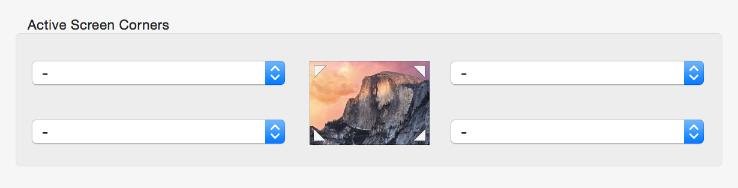

**带冒号的说明文字应该放在对应的控件之前。** 这些说明可以是一个名词或词组，用来描述这个控件的用途。以下几个例子展示的是说明文字与控件的空间位置关系：

- 文字与控件在同一行
	
		

- 文字与一列控件的第一行对齐
	
		

- 文字在一组水平排列的控件的最左边

	

- 文字在控件上方
	
	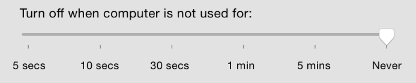

- 在一个多选框或者单选框里面使用冒号引出后面的控件（注意：如果前面的控件跟后面那个无关就不要用冒号，比如下图，后面那个控件是否生效时由前面那个来决定的，这时候可以用省略号。）

	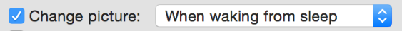

	注意
	如果你采用了上图的这种形式，当第一个控件没有选中的时候，第二个控件记得要置于禁用状态。

**如果一个控件是一句话或者一个词组的一部分，那么是否加上冒号就见仁见智了。** 这点比较灵活，因为要根据具体的情况来做决定，比如控件后面的文字有多长，具体这句话是断句的等等，要综合考虑文本和控件的组合形式还有窗口的整体布局等因素，才能决定是否使用冒号。

如果一个句子到了控件这里就结束了，即控件是句子的结尾，那么这时候用冒号是比较好的做法，因为这种情况其实是说明文字+控件的变种。比如下面这个例子， 控件上的 "Genie effect" 就是整个句子的结尾：

	

如果控件后面还有句子的一部分，那么冒号就可有可无了。

	

以此类推，只要控件后面有文字，并且是一个完整句子或者词组的一部分，就可以不加冒号。在这种情况下，可以先假设如果句子被冒号切成几段（甚至）的时候意思会不会显得不自然，如果会，就不要加冒号。

### 去掉句子间多余的空格

如果你的界面需要显示多个句子，请确保句号与第一个字母之间只有一个空格。多数控件都只需要简短的说明文字，但是像帮助文档，警告窗和对话框这些控件就常常会包含很长的文本。你需要仔细检查这些长文本，确保没有多余的空格。

## 集成到 OS X 系统

### 正确使用系统 UI

OS X 提供了很多系统 UI 元素，像控件，菜单和对话框等等。多用这些 UI 元素有几个好处：

- 用户对系统自带的 UI 元素都比较熟悉，可以让你的应用很容易上手。
- 多用系统 UI 可以让你的应用和整个系统保持统一的体验。
- 系统 UI 对半透明的 Vibrancy 效果做了优化，可以获得更好的显示效果。
- 系统更新的时候，你的界面会自动跟着更新。

但是这些好处的前提是你要正确地使用这些系统 UI，那么怎么用才叫正确呢？请看以下几点：

**不要给系统 UI 元素添加新的行为。** 根据本文档的说明，规范地使用系统 UI 是非常重要的，如果你用错了这些系统 UI，应用的行为就会变得很奇怪，无法预测，让用户觉得你的应用很难用。

**一般情况下，不要模仿创建一个系统 UI 元素。** 如果你的自定义 UI 跟系统 UI 长得一样，用户就会把这两者搞混，会觉得为什么这个控件长得跟系统的一样，但是行为又完全不同。同理，如果你的自定义 UI 的行为跟系统 UI 一样，用户就会觉得这两个东西有什么不同，为什么长的不一样？

**所以，如果你需要一种新的 UI 行为，那就设计一个全新的 UI 元素，** 而不是重新定义一个已经存在的 UI 元素的行为。但是要设计一个全新的 UI 元素，前提是这种设计有系统 UI 无法取代的优势，否则对用户来说只是增加学习成本，浪费时间罢了。

**不要直接复制别的平台的 UI 元素。** 用户不一定熟悉其他的平台，你不能假设所有用户都明白其他平台的一个控件是怎么用的。最好的做法是做一个自定义控件来实现这些功能，同时要保证这个控件的样式、行为跟 OS X 系统风格保持一致。

	重要提示
	自定义 UI 元素不会随着系统升级而升级，所以如果你用了自定义控件，你就有责任在系统升级的时候更新你的 UI 元素。

你可能会担心用系统控件会让你的应用看上去平淡无奇以致淹没在 OS X 应用的汪洋大海之中，但事实上多用系统控件反而可以让用户专注于你的内容，用人们真正关注的东西来打动用户。而且系统控件可以提供给用户稳定一致的体验，让应用变得更容易使用。

### 让你的应用触达更多的用户

为了让你的应用面向的市场更加广阔，在设计的初期就应该考虑辅助功能和国际化设计，早点动手要好过把应用做完了再从头改一遍。

OS X 自带了很多辅助功能，比如语音辅助 VoiceOver，放大模式 zoom 以及全键盘操作模式 keyboard access mode。VoiceOver 会用声音告诉有视力障碍的用户当前界面都有哪些东西以外，还会给可能在他旁边的视力完好的人高亮显示当前选中的元素。如果你的应用接入了这些辅助功能，就算是有障碍的用户也可以轻松使用。关于如何支持辅助功能，请参考[语音辅助 VoiceOver and Accessiblity]()一章。

	提示
	使用系统定义的颜色可以让你的应用在用户调整系统对比度和透明的时候相应地作出调整。（你可以在代码里面使用 NSWorkspaceAccessibilityDisplayOptionsDidChangeNotification 来接收通知。）

**使用系统提供的国际化配置来实现应用的本地化。** 国际化配置可以把应用的文字资源和图片资源从代码中抽离出来，一旦这些资源被抽离，根据不同的文化来做本地化就变得很简单了。更多关于国际化，本地化的细节，可以参考 [国际化与本地化指南 Internationalization and Localization Guide]()。

**把看得到的 UI 控件都做本地化。** 就是说，你要确保你的 UI 界面上的文字都可以被翻译成不同的语言以适应不同的国家。如果你用了自动布局(Auto Layout)功能，你可以定义好控件和说明文字之间的关系，然后系统就会自动根据文字的长度把控件拉伸。更多关于自动布局的内容，可以参考 [Cocoa Auto Layout]() 和 [Mac Technology Overview]。

**要留意图形和符号中可能潜在的意义，**确保你所用的这些图形和符号都能表意清晰，不会无意中冒犯到用户，必要的时候还要对这些资源做本地化修改。比如你可能会用一些代表美国节日的图片来表示季节——圣诞树，南瓜和烟花之类的——那你得对那些不熟悉美国节日的人做好本地化，把这些图片换成他们所熟悉的形象。

**要尊重用户的区域设置。** 在系统的语言与文本设置项里面，有很多关于日期，时间和数字（比如金钱数目和计量单位）显示格式的设置，系统也提供了相关的 API 来做这些内容的格式化。所以你最好不要自己做格式化。

**支持不同的地址格式。** 不要假设所有的地址都跟当前用户地址的格式一样，比如系统的联系人应用就可以根据不同的地区设置不同的地址格式。所以如果你支持展示系统联系人应用里面的数据，请注意一定要根据不同的地址格式做处理。

**尽量使用容易翻译的文字。** 翻译是一件复杂而精巧的事情（译者泪目 T^T），所以要尽量避免使用俗语成句和不规范的语法，对于菜单，对话框和帮助文本的遣词造句要思之再三。要知道美国英语被翻译成其他语言后长度可能会增加一半（译者注：中文翻译成其他语言通常会长很多很多，所以做国际化的时候要留意自动缩放控件长度，同时控制好界面布局空间）。

**在文字资源文件里面要尽可能使用完整的句子。** 分开几个部分拼凑成一个句子的文字，翻译后很可能就有语法问题了，比如英文和中文的语序可能就很不一样，还用原来的顺序来展示就前言不搭后语了。关于多语言的处理，请参考国际化指南部分。

**做界面布局的时候要留意文字的长度，位置和阅读方向。** 不同语言文字长度不同，阅读方向也有可能不同，很多中东地区的国家都习惯从右往左的阅读方向。界面上文本的位置和对齐方式也要保持灵活可变。

**尽可能根据内容的逻辑走向来做界面布局。** 比如对于习惯从左往右阅读的人来说，最重要的内容通常放在界面的左上方，反之则是右上方。界面里的每个元素如果都能够面向逻辑来做布局，而不是面向视觉和位置来做定义，扩展这个应用的市场就会容易得多。

### 向用户提供 OS X 式的体验

用户从来都不是在一个孤立的环境下使用某个应用，用户体验会受到来自系统特性和用户设置的影响。比如有些用户可能更想在你做的编辑器应用里使用全屏模式，然后切换到别的桌面用其他的应用来完成图片编辑的任务，有些用户可能想直接在你的应用里面调起一个扩展来完成图片编辑任务，甚至有障碍的用户会通过语音辅助或者其他辅助设备来使用你的应用。

所以最好的应用应该能够是集成到 OS X 系统里面的，集成度越高，用户越觉得这个应用跟系统是一体的。关于怎么利用系统提供的各个特性和技术，可以参考[应用扩展 App Extensions]()，[iCloud]()，[游戏中心 Game Center]()和[通知中心 Notification Center]()等章节。

但是至少，能符合用户预期的应用应该要做到以下几点：

- **拥抱 Vibrancy 效果。** Vibrancy 效果是一种通过提取背景的颜色做复杂的计算得出的模糊、半透明的效果，这种效果被广泛应用在通知中心，窗口的侧边栏，菜单和悬浮窗等各个地方。标准的 AppKit UI 都对 Vibrancy 效果做了优化。

你可以使用 NSVisualEffectView 来实现 Vibrancy 效果。

- **尊重系统的全局菜单，不要把菜单放到窗口里面。** OS X 系统在屏幕的顶部有一个全局菜单，所有的应用都在这里显示菜单。关于更多菜单栏的内容，请参见[菜单栏菜单 Menu Bar Menus]()。

- **集成到 Spotlight。** Spotlight 可以让用户方便地找到所有的东西。为了让用户搜得到应用创建的自定义文件，你需要支持导入数据到 Spotilight。更多关于 Spotlight 的内容，请参考[Spotlight]()。

- **利用 Dock 来展示实用信息。** 用户和系统都希望 Dock 的表现能够被他们的设置所控制，所以至少你的应用不应该和 Dock 的位置产生冲突。关于 Dock 的更多内容，请参见[Dock]()一章。

- **使用高质量的图标。** OS X 最大的魅力之一是系统中各种各样高分辨率、精致漂亮的图标。关于怎么设计这些图标，可以参考[设计应用图标 Design App Icons]()，[工具栏选项 Toolbar items]()和[侧边栏图标 Sidebar Icons]()。

**尊重 OS X 的多层窗口设计。** 确保使用了正确的类型来显示你的窗口，规范窗口的行为。（详见[关于窗口 About Windos]()）

**少用模态，**避免强迫用户必须完成当前任务之后才能做其他的事情。这种情况下使用 Sheet 和悬浮层会让用户觉得更自由一些（关于 Sheet 可以参考[使用基于文档的模态对话框 Use Document-Modal Dialogs (Sheets)]()和[悬浮层 Popover]()）。如果一定要用模态，就得清晰地指出当前的状态，确保用户可以很容易地进入和退出这种模式。

**把应用创建的文件存在合适的地方。** OS X 定义了几个特殊的位置用来存放应用相关的文件，比如应用的配置文件和用户创建的文件。不要把应用的文件随便乱放，这样很容易跟其他文件混杂在一起，用户很难找到这些文件。（译者注：比如下载的文件就进下载目录，用户自己创建的文件就默认存文档目录。）关于文件系统的更多内容，可以参考文件系统概览 File System Overview 一文。

**要支持系统的多用户切换机制。** OS X 是允许多个用户同时使用的，如果用户使用快速切换功能登录了一个新帐号，那么这时候前一个用户的帐号其实还是在后台跑的。所以在这种多用户环境下，要确保你的设计不依赖与全局独占资源，也不要假设一个用户服务只会有一个实例。关于快速切换的更多信息，可以参考[多用户环境编程 Multiple User Environment Programming Topics]()。

**支持手势。** OS X 系统通过多点触摸手势可以让用户很方便地打开通知中心，切换桌面，打开 LaunchPad 等等。更多关于支持手势的文档，可以参考[手势可以增强用户体验 Gestures Can Enhance the User Experience]()。

**支持配置文件显示名。** OS X 可以配置文件、文件夹和应用在不同情况下显示不同的名字（比如中文下载目录是“下载”，英文就是”Downloads”），但是你的配置要根据用户在系统的设置项来做。关于文件扩展名的相关信息，可以看[协作性 Interoperability]()一章。

**不要覆盖系统保留的快捷键，同时尽量不要修改 Apple 推荐的快捷键设置。** 用户其实一般都分不清系统快捷键和苹果推荐的快捷键有什么区别，不过他们认为这两种快捷键都应该和正在用的应用无关。关于支持键盘操作的更多信息，可以看[键盘 Keyboard]()一章。

**支持拖拽手势。** 拖拽手势在 OS X 上是被普遍采用的一种交互方式，这也是 OS X 平台最有名的特性之一。尽管拖拽手势能实现的功能也要确保能够通过键盘实现，但是支持拖拽这种更直接更自然的操作还是非常有必要的。详情可参见[拖拽手势 Drag and Drop]()。

**支持剪贴板。** 剪贴板可以让用户实现在多个应用间交换数据，要确保你的应用支持剪切，复制和粘贴这些功能。更多关于剪贴板的操作信息，可以参见[编辑菜单 The Edit Menu]()和[格式菜单 The Format Menu]()。

